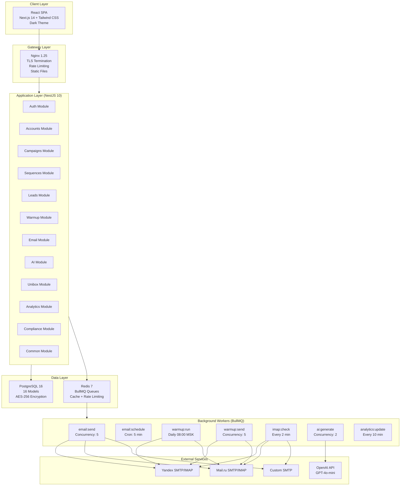
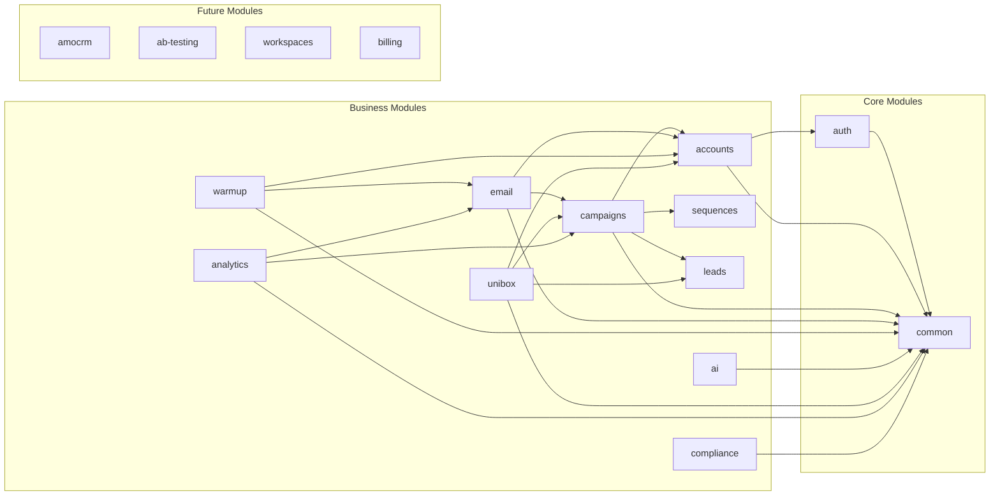
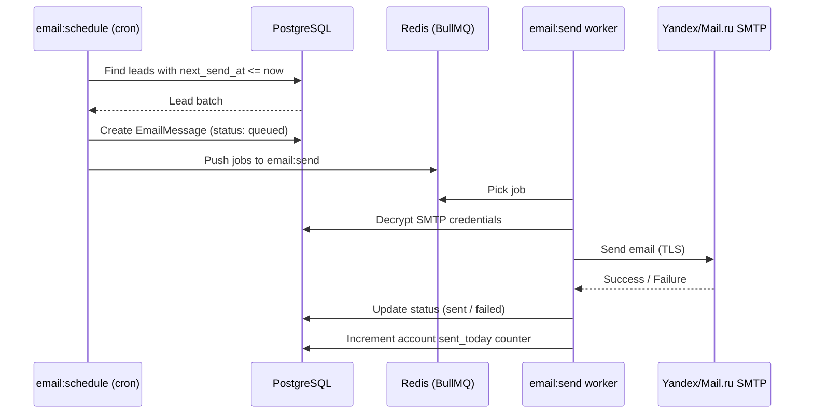
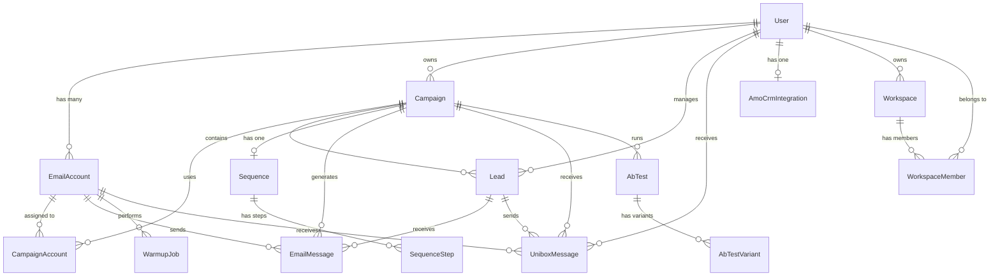

# ColdMail.ru -- System Architecture

## High-Level Architecture Diagram

## Technology Stack

| Layer          | Technology                | Version | Purpose                              |
|----------------|---------------------------|---------|--------------------------------------|
| Frontend       | React + Next.js           | 18 / 14 | SPA with App Router                  |
| Styling        | Tailwind CSS              | 3.4     | Utility-first CSS, dark theme tokens |
| State          | Zustand + React Query     | --      | Client and server state management   |
| Forms          | React Hook Form + Zod     | --      | Form handling with schema validation |
| Charts         | Recharts                  | --      | Analytics visualizations             |
| Backend        | NestJS (Node.js)          | 10 / 20 | Modular API framework, TypeScript    |
| ORM            | Prisma                    | 5.x     | Type-safe database access, migrations|
| Database       | PostgreSQL                | 16      | Primary data store, ACID compliant   |
| Cache / Queue  | Redis                     | 7.x     | BullMQ job queues, caching           |
| Email Client   | Nodemailer                | 6.x     | SMTP sending                         |
| IMAP Client    | imapflow                  | 1.x     | Inbox monitoring                     |
| AI             | OpenAI SDK                | 4.x     | GPT-4o-mini email generation         |
| Auth           | Passport.js + JWT + bcrypt| --      | Authentication and authorization     |
| Reverse Proxy  | Nginx                     | 1.25    | TLS, rate limiting, static files     |
| Containers     | Docker + Docker Compose   | 24 / 2.x| Deployment and orchestration         |
| Monitoring     | Prometheus + Grafana      | --      | Metrics and dashboards               |
| Logging        | Pino + Loki               | --      | Structured JSON logs, aggregation    |
| CI/CD          | GitHub Actions            | --      | Automated testing and deployment     |

## NestJS Modules (16)

| Module       | Responsibility                                         | Key Endpoints                     |
|--------------|--------------------------------------------------------|-----------------------------------|
| `auth`       | JWT login, registration, refresh token rotation        | `/auth/login`, `/auth/register`   |
| `accounts`   | Email account CRUD, connection testing                 | `/accounts`, `/accounts/:id/test` |
| `campaigns`  | Campaign lifecycle: create, start, pause, stop         | `/campaigns`, `/campaigns/:id`    |
| `sequences`  | Sequence steps, template rendering with variables      | `/sequences`, `/sequences/:id`    |
| `leads`      | Lead management, CSV import, status tracking           | `/leads`, `/leads/import`         |
| `warmup`     | Warmup engine logic, peer selection, scheduling        | `/warmup/:accountId/start`        |
| `email`      | SMTP sending, IMAP checking, deliverability tracking   | Internal (worker-facing)          |
| `ai`         | OpenAI integration, prompt management, generation      | `/ai/generate`                    |
| `unibox`     | Reply aggregation, thread view, reply sending          | `/unibox`, `/unibox/:id/reply`    |
| `analytics`  | Metrics calculation, time-series data                  | `/analytics`, `/analytics/:id`    |
| `compliance` | 38-FZ checker, opt-out management, content validation  | Internal                          |
| `common`     | Shared utilities: encryption, logging, error handling  | Internal                          |
| `amocrm`     | AmoCRM OAuth, contact sync (v1.0)                      | `/integrations/amocrm`            |
| `ab-testing` | A/B test variants, winner selection (v1.0)             | `/campaigns/:id/ab-test`          |
| `workspaces` | Multi-tenant workspaces, team management (v1.0)        | `/workspaces`                     |
| `billing`    | Plan management, usage metering (v1.0)                 | `/billing`                        |

## BullMQ Workers (7)

| Queue              | Purpose                                   | Concurrency | Schedule           |
|--------------------|-------------------------------------------|:-----------:|--------------------|
| `email:send`       | Send campaign emails via SMTP             | 5           | On demand          |
| `email:schedule`   | Calculate and queue next email batch      | 1           | Cron: every 5 min  |
| `warmup:run`       | Orchestrate daily warmup interactions     | 3           | Daily at 08:00 MSK |
| `warmup:send`      | Send individual warmup emails             | 5           | On demand          |
| `imap:check`       | Check inboxes for replies and bounces     | 3           | Every 2 min        |
| `ai:generate`      | Batch AI personalization of emails        | 2           | On demand          |
| `analytics:update` | Recalculate campaign metrics              | 1           | Every 10 min       |

### Email Sending Pipeline

## PostgreSQL Schema (16 Models)

### Model Summary

| Model              | Table Name           | Key Fields                                    |
|--------------------|----------------------|-----------------------------------------------|
| User               | `users`              | email, plan, password_hash                    |
| EmailAccount       | `email_accounts`     | provider, smtp/imap credentials, warmup_status|
| Campaign           | `campaigns`          | status, schedule, sent/opened/replied counts  |
| CampaignAccount    | `campaign_accounts`  | campaign_id, account_id (junction)            |
| Lead               | `leads`              | email, status, current_step, next_send_at     |
| Sequence           | `sequences`          | campaign_id (1:1)                             |
| SequenceStep       | `sequence_steps`     | order, subject, body, delay_days              |
| EmailMessage       | `email_messages`     | status, sent_at, opened_at, message_id        |
| WarmupJob          | `warmup_jobs`        | type, target_email, scheduled_at              |
| UniboxMessage      | `unibox_messages`    | from_email, subject, body, read status        |
| AmoCrmIntegration  | `amocrm_integrations`| domain, tokens, connection status             |
| AbTest             | `ab_tests`           | test_type, status, winner_id                  |
| AbTestVariant      | `ab_test_variants`   | subject, body, performance counters           |
| Workspace          | `workspaces`         | name, owner_id                                |
| WorkspaceMember    | `workspace_members`  | workspace_id, user_id, role                   |

**Note:** The 16th model is the Prisma `_prisma_migrations` table used internally by the ORM.

### Key Indexes

| Index                                        | Purpose                        |
|----------------------------------------------|--------------------------------|
| `leads(campaign_id, status, next_send_at)`   | Email scheduling queries       |
| `email_messages(campaign_id, status)`        | Analytics aggregation          |
| `email_accounts(user_id, warmup_status)`     | Account listing and filtering  |
| `unibox_messages(user_id, read, received_at)`| Unibox inbox queries           |

## Redis Usage

| Purpose              | Key Pattern                        | TTL           |
|----------------------|------------------------------------|---------------|
| JWT blacklist        | `auth:blacklist:{token_id}`        | 15 min        |
| Rate limiting        | `ratelimit:{user_id}:{endpoint}`   | 1 min         |
| Daily send counters  | `account:{id}:sent_today`          | Reset midnight |
| Campaign metrics     | `analytics:{campaign_id}`          | 10 min        |
| BullMQ queues        | `bull:{queue_name}:*`              | Persistent    |

## Security Architecture

### Authentication

- **Method:** Email + password with bcrypt hashing (12 rounds)
- **Tokens:** JWT access token (15 min) + refresh token (7 days)
- **Storage:** httpOnly cookies (no client-side JavaScript access)
- **Refresh:** Automatic rotation on refresh endpoint

### Encryption

| Data                 | Method        | Key Source         |
|----------------------|---------------|--------------------|
| User passwords       | bcrypt        | N/A (one-way hash) |
| SMTP/IMAP passwords  | AES-256-GCM   | `ENCRYPTION_KEY` env |
| Data in transit      | TLS 1.3       | Let's Encrypt cert |

### Rate Limiting

| Endpoint               | Limit        | Window  |
|------------------------|:------------:|---------|
| `POST /auth/login`     | 5 attempts   | 15 min  |
| `POST /auth/register`  | 3 requests   | 1 hour  |
| `POST /ai/*`           | 30 requests  | 1 min   |
| `GET /api/*`           | 100 requests | 1 min   |
| `POST /leads/import`   | 5 imports    | 1 hour  |

## Scaling Strategy

### Bottleneck Analysis

| Bottleneck               | Threshold               | Solution                             |
|--------------------------|-------------------------|--------------------------------------|
| SMTP sending rate        | 500/day per Yandex account| Add more accounts, IP rotation      |
| IMAP checking frequency  | 2 min x N accounts      | Batch processing, webhook fallback   |
| AI generation latency    | ~10s per email           | Pre-generate in batches, queue       |
| PostgreSQL connections   | 100 connections          | PgBouncer connection pooling         |
| Redis memory             | 1 GB for queues          | Key TTL policies, cleanup jobs       |

### Horizontal Scaling Path

1. **MVP:** Single VPS, all Docker containers -- handles 100 users, 50K emails/day
2. **Growth:** Separate DB server, add worker replicas -- handles 1,000 users, 500K emails/day
3. **Scale:** Migrate to Kubernetes with autoscaling -- handles 10,000+ users, 5M emails/day
