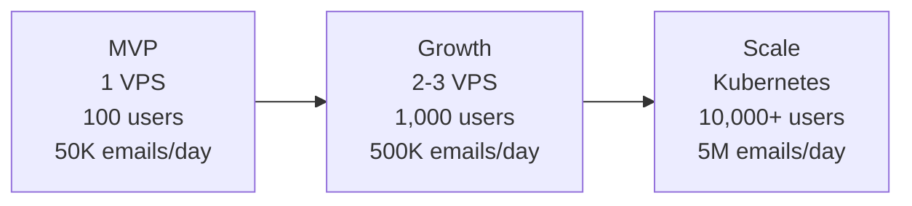
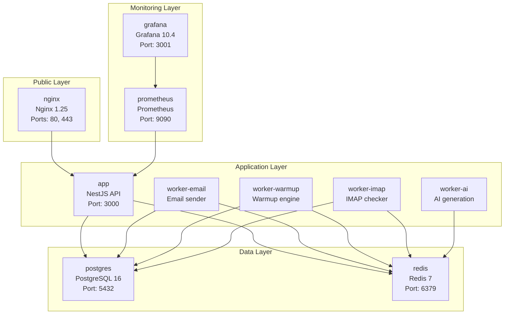
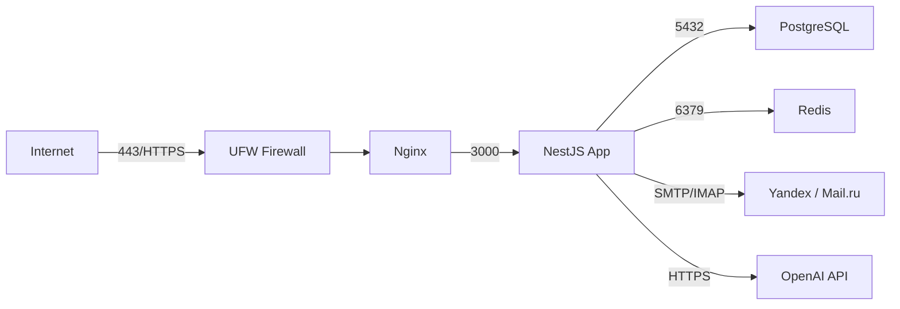

# ColdMail.ru -- Infrastructure

## Scaling Stages

### Stage 1: MVP (Single VPS)

All services run on a single VPS via Docker Compose.

| Component      | Spec             | Purpose                            |
|----------------|------------------|------------------------------------|
| VPS            | 4 vCPU, 8 GB RAM | Application, workers, proxy        |
| Storage        | 200 GB SSD       | Database, logs, Redis persistence  |
| Location       | Russia (Moscow)  | 152-FZ compliance                  |
| OS             | Ubuntu 22.04 LTS | Docker-compatible, stable          |
| Provider       | AdminVPS / HOSTKEY| Russian data center                |

**Capacity:** ~100 concurrent users, ~50,000 emails per day.

### Stage 2: Growth (2-3 VPS)

Separate data layer from application layer for improved reliability.

| Server      | Spec               | Services                             |
|-------------|---------------------|--------------------------------------|
| App VPS     | 4 vCPU, 8 GB RAM   | Nginx, NestJS app, all workers       |
| Data VPS    | 2 vCPU, 4 GB RAM   | PostgreSQL 16, Redis 7               |
| Worker VPS  | 4 vCPU, 8 GB RAM   | Additional worker replicas (optional)|

**Capacity:** ~1,000 concurrent users, ~500,000 emails per day.

Key changes from MVP:
- PostgreSQL runs on a dedicated server with more disk I/O
- Add PgBouncer for connection pooling (100+ connections)
- Redis gets dedicated memory allocation
- Worker replicas can be scaled horizontally

### Stage 3: Scale (Kubernetes)

Migrate to Kubernetes on a Russian cloud provider (Yandex Cloud, Selectel).

| Component          | Service                                  |
|--------------------|------------------------------------------|
| Orchestration      | Managed Kubernetes (Yandex MKS / Selectel)|
| Database           | Managed PostgreSQL (Yandex MDB)          |
| Cache / Queue      | Managed Redis                            |
| Container Registry | Private registry                         |
| Load Balancer      | Cloud LB with TLS termination            |

**Capacity:** 10,000+ users, 5,000,000 emails per day with horizontal pod autoscaling.

## Port Mapping

### Internal Ports (Docker Network)

| Service      | Internal Port | Protocol | Notes                    |
|--------------|:-------------:|----------|--------------------------|
| Nginx        | 80, 443       | HTTP/S   | Public-facing            |
| NestJS App   | 3000           | HTTP     | API server               |
| PostgreSQL   | 5432           | TCP      | Database                 |
| Redis        | 6379           | TCP      | Queue and cache          |
| Prometheus   | 9090           | HTTP     | Metrics collection       |
| Grafana      | 3000 (mapped 3001) | HTTP | Monitoring dashboards   |

### Exposed Ports (Host)

Only these ports should be accessible from the internet:

| Port | Service   | Purpose                |
|:----:|-----------|------------------------|
| 22   | SSH       | Server administration  |
| 80   | Nginx     | HTTP (redirects to 443)|
| 443  | Nginx     | HTTPS (TLS)            |

All other ports (5432, 6379, 9090, 3001) must be blocked by the firewall and accessible only within the Docker network or via SSH tunnel.

## Docker Compose Services (11 Total)

### Service Details

| # | Service          | Image                    | Depends On       | Restart Policy   |
|:-:|------------------|--------------------------|------------------|------------------|
| 1 | `nginx`          | `nginx:1.25-alpine`      | app              | unless-stopped   |
| 2 | `app`            | Custom (Dockerfile)      | postgres, redis  | unless-stopped   |
| 3 | `worker-email`   | Custom (Dockerfile)      | postgres, redis  | unless-stopped   |
| 4 | `worker-warmup`  | Custom (Dockerfile)      | postgres, redis  | unless-stopped   |
| 5 | `worker-imap`    | Custom (Dockerfile)      | postgres, redis  | unless-stopped   |
| 6 | `worker-ai`      | Custom (Dockerfile)      | redis            | unless-stopped   |
| 7 | `postgres`       | `postgres:16-alpine`     | --               | unless-stopped   |
| 8 | `redis`          | `redis:7-alpine`         | --               | unless-stopped   |
| 9 | `prometheus`     | `prom/prometheus:v2.51.0`| --               | unless-stopped   |
|10 | `grafana`        | `grafana/grafana:10.4.0` | prometheus       | unless-stopped   |
|11 | `loki`           | `grafana/loki:latest`    | --               | unless-stopped   |

### Docker Volumes

| Volume            | Purpose                          | Backup Required |
|-------------------|----------------------------------|:---------------:|
| `postgres_data`   | PostgreSQL data files            | Yes             |
| `redis_data`      | Redis AOF and RDB snapshots      | Yes             |
| `prometheus_data` | Prometheus TSDB metrics          | No              |
| `grafana_data`    | Grafana dashboards and settings  | Recommended     |

## External API Dependencies

| Service           | Protocol    | Direction     | Purpose                        | Required |
|-------------------|-------------|---------------|--------------------------------|:--------:|
| Yandex.Mail       | SMTP / IMAP | Bidirectional | Send and receive campaign emails| Yes     |
| Mail.ru           | SMTP / IMAP | Bidirectional | Send and receive campaign emails| Yes     |
| Custom SMTP       | SMTP / IMAP | Bidirectional | User-provided mail servers     | Optional |
| OpenAI API        | HTTPS       | Outbound      | AI email generation (GPT-4o-mini)| Yes    |
| Let's Encrypt     | HTTPS       | Outbound      | TLS certificate issuance       | Yes      |
| GitHub            | HTTPS / SSH | Outbound      | CI/CD pipeline, source code    | Yes      |

### Rate Limits (External)

| Service      | Limit                  | Mitigation                          |
|--------------|------------------------|-------------------------------------|
| Yandex SMTP  | ~500 emails/day/account| Use multiple accounts, rotate       |
| Mail.ru SMTP | ~500 emails/day/account| Use multiple accounts, rotate       |
| OpenAI API   | Varies by tier         | Queue-based processing, retry logic |

## Network Topology (MVP)

All inter-service communication happens over the Docker bridge network. External traffic enters only through Nginx on ports 80 and 443.
