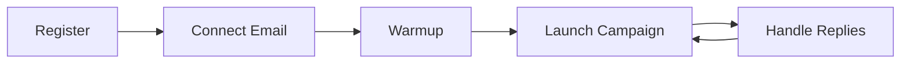
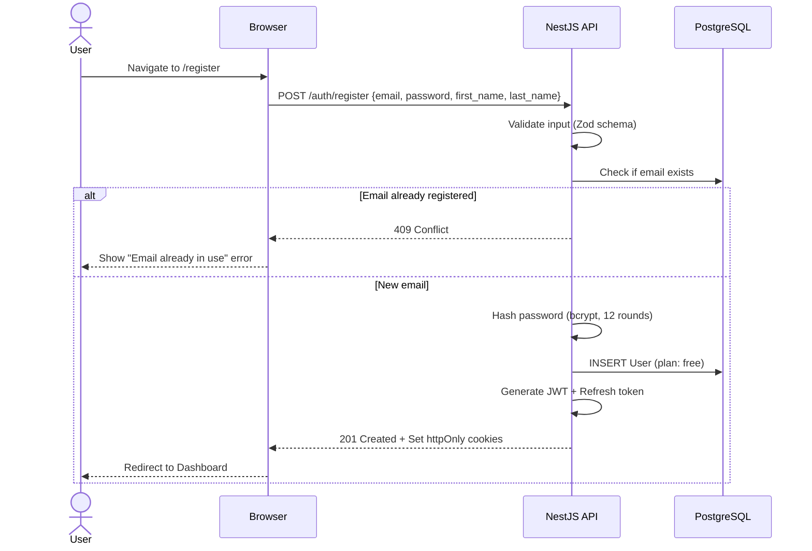
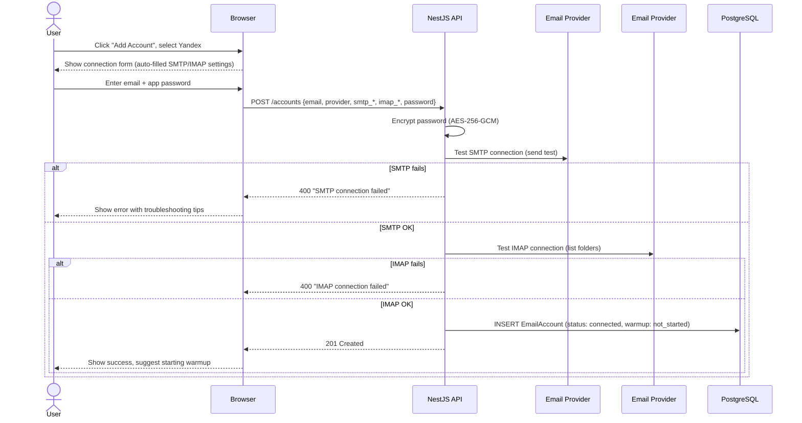
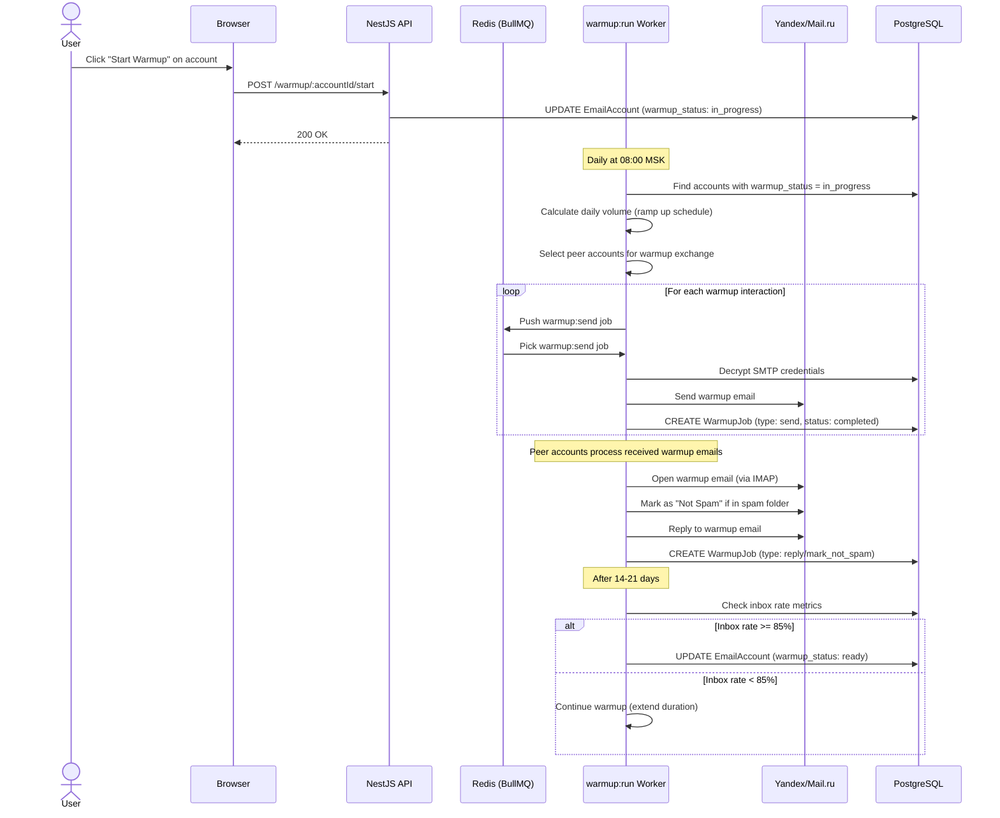
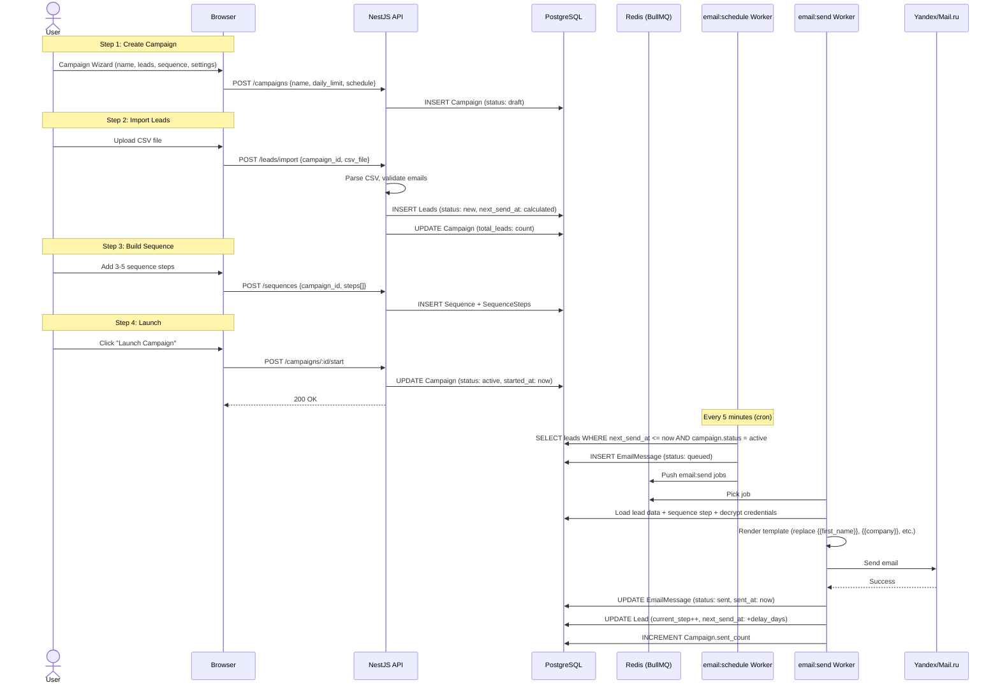
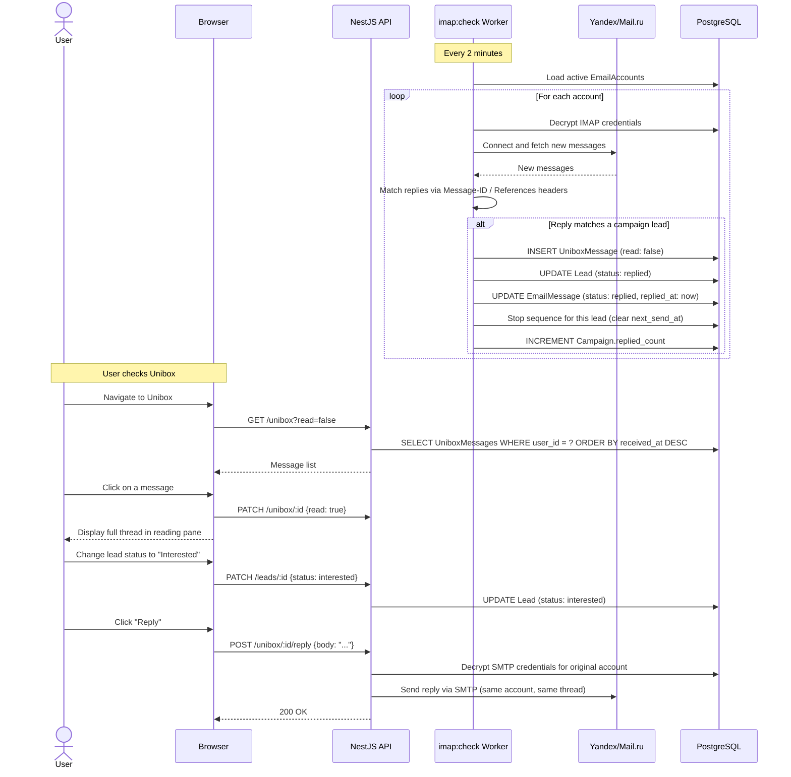
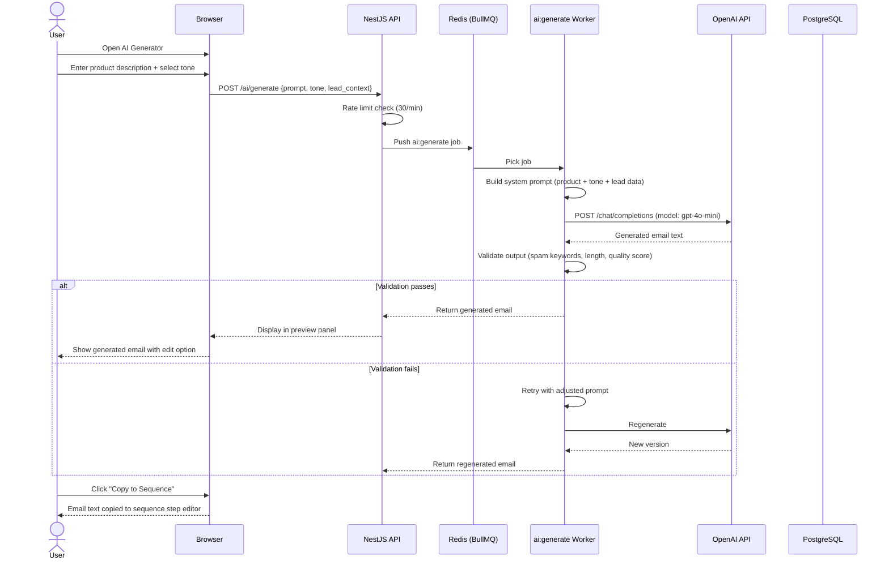
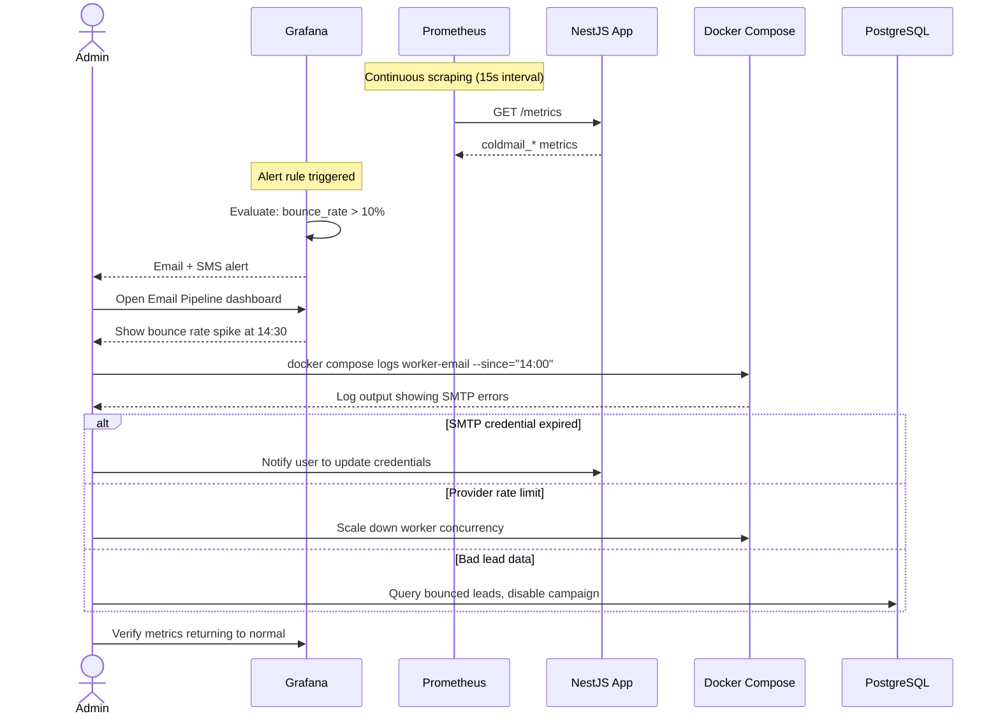
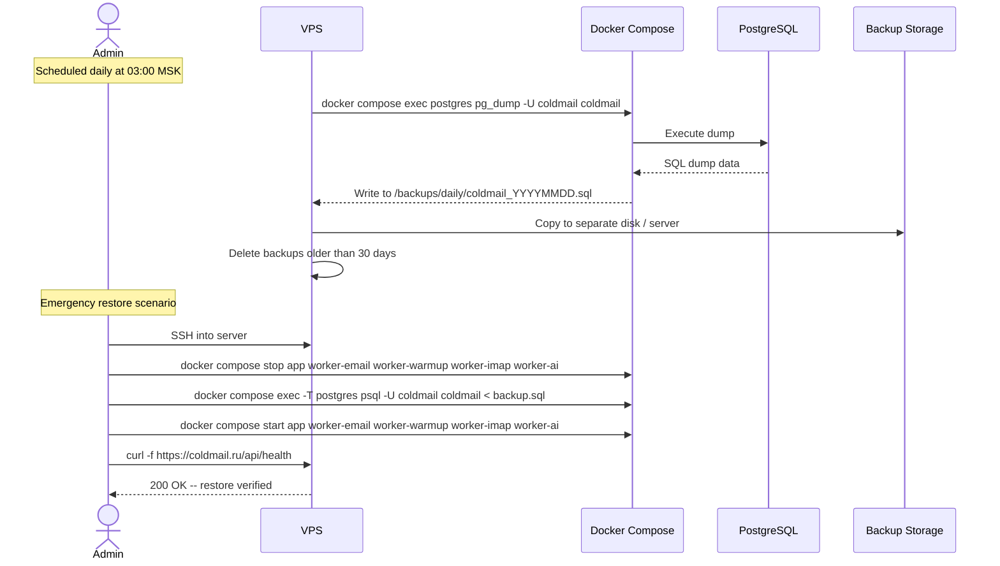
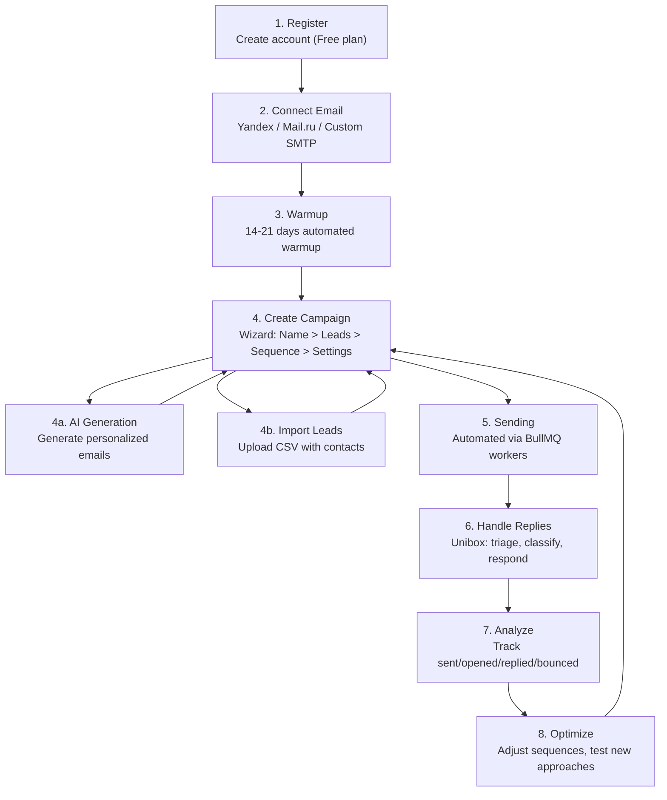

# ColdMail.ru -- User and Admin Flows

## User Flow Overview

The primary user journey follows five stages: register, connect email, warm up, launch campaign, and handle replies.

---

## Flow 1: User Registration

### Post-Registration State

- Plan: Free (1 account, 50 emails/day, 20 AI credits)
- Dashboard shows empty state with onboarding prompts
- Guided tour suggests connecting the first email account

---

## Flow 2: Connect Email Account

---

## Flow 3: Email Warmup

### Warmup Ramp-Up Schedule

| Day   | Emails/Day | Actions                              |
|:-----:|:----------:|--------------------------------------|
| 1-3   | 5          | Send, receive, mark not spam         |
| 4-7   | 10         | Add replies to warmup interactions   |
| 8-14  | 20         | Full warmup cycle                    |
| 15-21 | 30         | Stabilize reputation                 |
| 21+   | Maintenance| 5-10 emails/day to maintain score    |

---

## Flow 4: Campaign Creation and Execution

---

## Flow 5: Reply Handling (Unibox)

---

## Flow 6: AI Email Generation

---

## Flow 7: Admin -- Monitoring and Incident Response

---

## Flow 8: Admin -- Backup and Restore

---

## Complete User Journey Summary

