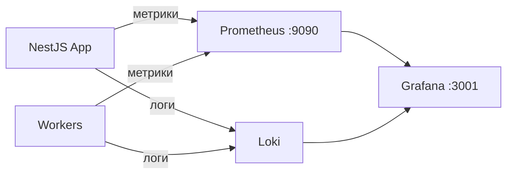

# Руководство администратора ColdMail.ru

**Версия:** 0.2 | **Дата:** 2026-04-29

---

## Ролевая модель

Система поддерживает две роли в рамках рабочего пространства (Workspace):

| Роль | Описание | Права |
|------|----------|-------|
| **owner** | Владелец рабочего пространства | Полный доступ: настройки, биллинг, управление участниками |
| **member** | Участник команды | Кампании, аккаунты, лиды, аналитика (без биллинга и настроек) |

### Матрица разрешений

| Действие | owner | member |
|----------|:-----:|:------:|
| Управление кампаниями (CRUD, запуск/пауза) | + | + |
| Управление email-аккаунтами | + | + |
| Импорт и управление лидами | + | + |
| Просмотр аналитики | + | + |
| Настройки рабочего пространства | + | - |
| Биллинг и тарифный план | + | - |
| Приглашение/удаление участников | + | - |
| Интеграции (AmoCRM) | + | - |

---

## Конфигурация (.env)

### Основные параметры

```bash
# Приложение
NODE_ENV=production              # production | development
PORT=3000                        # Порт API-сервера
APP_URL=https://coldmail.ru      # Публичный URL
JWT_SECRET=<64-символа>          # Секрет для подписи JWT
JWT_EXPIRES_IN=15m               # Время жизни access-токена
REFRESH_TOKEN_EXPIRES_IN=7d      # Время жизни refresh-токена

# База данных
DATABASE_URL=postgresql://coldmail:пароль@db:5432/coldmail
DATABASE_POOL_SIZE=20            # Размер пула соединений

# Redis
REDIS_URL=redis://redis:6379

# Шифрование (SMTP/IMAP-учётные данные)
ENCRYPTION_KEY=<32-байта-hex>    # AES-256-GCM ключ
ENCRYPTION_IV_LENGTH=16          # Длина вектора инициализации

# AI
OPENAI_API_KEY=sk-...            # Ключ OpenAI API
OPENAI_MODEL=gpt-4o-mini         # Модель для генерации
AI_MAX_TOKENS=500                # Лимит токенов на запрос
AI_TEMPERATURE=0.7               # Температура генерации

# Трекинг
TRACKING_DOMAIN=track.coldmail.ru

# Resend (опционально, если используется как email-провайдер)
RESEND_API_KEY=re_...            # API-ключ Resend
RESEND_FROM_EMAIL=noreply@coldmail.ru  # Адрес отправителя в Resend
```

### Критически важные секреты

| Параметр | Требования | Как сгенерировать |
|----------|-----------|-------------------|
| JWT_SECRET | 64+ символов, случайная строка | `openssl rand -hex 32` |
| ENCRYPTION_KEY | 32 байта hex | `openssl rand -hex 32` |
| POSTGRES_PASSWORD | Надёжный пароль | `openssl rand -base64 24` |
| OPENAI_API_KEY | Действующий API-ключ | Из dashboard.openai.com |
| RESEND_API_KEY | Действующий API-ключ (при использовании Resend) | Из dashboard resend.com |

> **Внимание:** никогда не коммитьте `.env` файл в репозиторий. Используйте `.env.example` как шаблон.

---

## Управление email-провайдерами

### Выбор провайдера: SMTP vs Resend

ColdMail.ru поддерживает два способа отправки email:

| Характеристика | SMTP | Resend |
|---------------|------|--------|
| Тип подключения | Прямое SMTP-соединение с почтовым сервером | REST API |
| Настройка | Хост, порт, логин, пароль для каждого аккаунта | Один API-ключ + адрес отправителя |
| Провайдеры | Yandex, Mail.ru, любой Custom SMTP | Resend (resend.com) |
| Warmup | Поддерживается | Не применимо |
| Персонализация отправителя | Каждый аккаунт -- отдельный отправитель | Единый адрес отправителя |
| Когда использовать | Рассылки от имени конкретных сотрудников | Централизованная отправка через API |

### Настройка провайдера через UI

Пользователи с ролью **owner** могут выбрать и настроить email-провайдер через веб-интерфейс:

1. Перейдите в **Настройки** -> вкладка **Системные**
2. В секции **Email-провайдер** выберите **SMTP** или **Resend**
3. Заполните соответствующие поля:
   - **SMTP**: хост и порт по умолчанию (используются при создании новых аккаунтов)
   - **Resend**: API-ключ и адрес отправителя (From Email)
4. Используйте кнопку **Тест** для проверки подключения
5. Нажмите **Сохранить**

> **Важно:** при переключении провайдера на Resend, индивидуальные SMTP-аккаунты (Yandex, Mail.ru) продолжают работать. Resend используется как дополнительный канал отправки.

### Конфигурация Resend

Для использования Resend в качестве провайдера:

1. Зарегистрируйтесь на [resend.com](https://resend.com)
2. Добавьте и верифицируйте ваш домен
3. Создайте API-ключ в разделе API Keys
4. В ColdMail.ru перейдите в **Настройки** -> **Системные** -> **Email-провайдер**
5. Выберите **Resend**, введите API-ключ и From Email
6. Протестируйте подключение кнопкой **Тест Resend**

Параметры Resend хранятся в таблице `settings` и шифруются аналогично SMTP-учётным данным.

### Поддерживаемые SMTP-провайдеры

| Провайдер | SMTP-хост | Порт | IMAP-хост | Порт |
|-----------|-----------|------|-----------|------|
| Yandex | smtp.yandex.ru | 465 (SSL) | imap.yandex.ru | 993 |
| Mail.ru | smtp.mail.ru | 465 (SSL) | imap.mail.ru | 993 |
| Custom SMTP | Указывается при подключении | Varies | Указывается | Varies |

### Лимиты отправки

| Провайдер | Дневной лимит | Рекомендация |
|-----------|--------------|-------------|
| Yandex | 500 писем/сутки | Начинать с 20-30, увеличивать постепенно |
| Mail.ru | 300 писем/сутки | Начинать с 15-20 |
| Custom | Зависит от сервера | Уточнять у провайдера |
| Resend | Зависит от тарифа Resend | См. документацию resend.com |

### Хранение учётных данных

Все SMTP/IMAP-пароли и API-ключи (включая Resend) хранятся в зашифрованном виде (AES-256-GCM). Каждая операция шифрования использует уникальный вектор инициализации (IV). Ключ шифрования берётся из переменной `ENCRYPTION_KEY`.

---

## Управление системными переменными через UI

Начиная с версии 0.2, все ключевые системные параметры настраиваются через веб-интерфейс (раздел **Настройки** -> вкладка **Системные**). Это позволяет владельцам рабочих пространств управлять конфигурацией без доступа к серверу и редактирования `.env` файлов.

### Параметры, доступные через UI

| Секция | Параметры | Описание |
|--------|-----------|----------|
| **AI (OpenAI)** | API-ключ, модель, max tokens, temperature | Настройки AI-генерации писем |
| **Расписание** | Часовой пояс, часы отправки, дневной лимит | Значения по умолчанию для новых кампаний |
| **Email-провайдер** | Тип (SMTP/Resend), хост/порт или API-ключ | Выбор способа отправки |
| **Трекинг** | Домен отслеживания | Для tracking pixel (открытия писем) |
| **Compliance** | Ссылка отписки, название компании, контакты | Соответствие 152-ФЗ и anti-spam |

### Приоритет конфигурации

Параметры, заданные через UI, сохраняются в таблице `settings` в базе данных и имеют приоритет над значениями из `.env` файла. Если значение не задано в UI, используется значение из `.env` (если есть) или значение по умолчанию.

### Тестирование подключений

Через UI доступны кнопки тестирования:
- **Тест OpenAI** -- проверяет валидность API-ключа и доступность модели
- **Тест SMTP** -- проверяет подключение к SMTP-серверу с указанными параметрами
- **Тест Resend** -- проверяет валидность API-ключа Resend

---

## Мониторинг

### Стек мониторинга



### Prometheus (порт 9090)

Основные метрики:

| Метрика | Тип | Описание |
|---------|-----|----------|
| `coldmail_http_requests_total` | Counter | Общее число HTTP-запросов |
| `coldmail_http_duration_seconds` | Histogram | Латентность запросов |
| `coldmail_emails_sent_total` | Counter | Отправленные письма по статусам |
| `coldmail_emails_queued` | Gauge | Текущая глубина очереди |
| `coldmail_warmup_inbox_rate` | Gauge | Средний inbox rate по провайдерам |
| `coldmail_active_campaigns` | Gauge | Число активных кампаний |
| `coldmail_db_connections_active` | Gauge | Активные соединения с PostgreSQL |

### Grafana (порт 3001)

Доступ: `http://your-server:3001`, логин: `admin`, пароль: из `GRAFANA_ADMIN_PASSWORD`.

Рекомендуемые дашборды:

1. **Overview** -- KPI: пользователи, кампании, письма, ошибки
2. **Email Pipeline** -- глубина очередей, скорость отправки, bounce rate
3. **Warmup Health** -- inbox rate по провайдерам, прогресс прогрева
4. **Infrastructure** -- CPU, RAM, диск, сеть, PostgreSQL, Redis

### Правила алертов

| Алерт | Условие | Критичность |
|-------|---------|-------------|
| Высокий error rate | > 5% за 5 мин | Critical |
| Медленный API | p99 > 2с за 10 мин | Warning |
| Переполнение очереди | depth > 1000 за 15 мин | Warning |
| Высокий bounce rate | > 10% за час | Critical |
| Мало места на диске | usage > 85% | Warning |
| Приложение недоступно | health check fails 3x | Critical |

---

## Резервное копирование

### PostgreSQL

```bash
# Ежедневный полный бэкап
docker compose exec postgres pg_dump -U coldmail coldmail | \
  gzip > /backup/coldmail_$(date +%Y%m%d_%H%M%S).sql.gz

# WAL-архивирование (ежечасно) для point-in-time recovery
# Настраивается через postgresql.conf
```

| Параметр | Значение |
|----------|---------|
| Полный бэкап | Ежедневно |
| WAL-архивирование | Ежечасно |
| Хранение | 30 дней |
| Расположение | Отдельный сервер в том же ДЦ |

### Redis

```bash
# Redis использует RDB-снапшоты (каждый час)
# Данные хранятся в volume redis_data
docker compose exec redis redis-cli BGSAVE
```

| Параметр | Значение |
|----------|---------|
| RDB-снапшот | Каждый час |
| Хранение | 7 дней |
| AOF | Включён (appendonly yes) |

### Восстановление из бэкапа

```bash
# PostgreSQL
gunzip < /backup/coldmail_20260429.sql.gz | \
  docker compose exec -T postgres psql -U coldmail coldmail

# Redis -- перезапуск с восстановлением из dump.rdb
docker compose restart redis
```

---

## Устранение неполадок

### Диагностические команды

```bash
# Статус всех сервисов
docker compose ps

# Логи конкретного сервиса (последние 100 строк)
docker compose logs --tail=100 app
docker compose logs --tail=100 worker-email

# Проверка соединения с PostgreSQL
docker compose exec postgres pg_isready -U coldmail

# Проверка Redis
docker compose exec redis redis-cli ping

# Глубина очередей BullMQ
docker compose exec redis redis-cli LLEN bull:email:send:wait
```

### Частые проблемы

| Симптом | Возможная причина | Решение |
|---------|------------------|---------|
| 502 Bad Gateway | App-контейнер не запустился | `docker compose logs app`, проверить `.env` |
| Письма не отправляются | Worker-email упал | `docker compose restart worker-email` |
| Warmup не работает | Неверные SMTP-данные аккаунта | Проверить подключение в интерфейсе |
| AI не генерирует | Невалидный OPENAI_API_KEY | Проверить ключ, баланс OpenAI |
| Высокий bounce rate | Аккаунт не прогрет | Запустить warmup, уменьшить дневной лимит |
| PostgreSQL OOM | Мало RAM для пула | Уменьшить `DATABASE_POOL_SIZE` |
| Очередь растёт бесконечно | Worker не обрабатывает задачи | Проверить логи worker, перезапустить |
| Resend API ошибка 403 | Невалидный API-ключ или неверифицированный домен | Проверить ключ в настройках, верифицировать домен в Resend |
| Resend From Email отклонён | Адрес отправителя не совпадает с верифицированным доменом | Указать корректный From Email, совпадающий с доменом в Resend |

### Экстренные действия

```bash
# Остановить все кампании (экстренно)
docker compose exec app npx ts-node scripts/pause-all-campaigns.ts

# Очистить зависшую очередь
docker compose exec redis redis-cli DEL bull:email:send:wait

# Полный перезапуск всех сервисов
docker compose down && docker compose up -d
```
