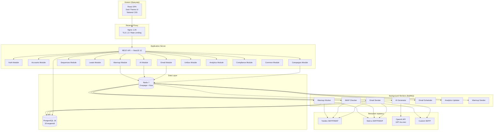
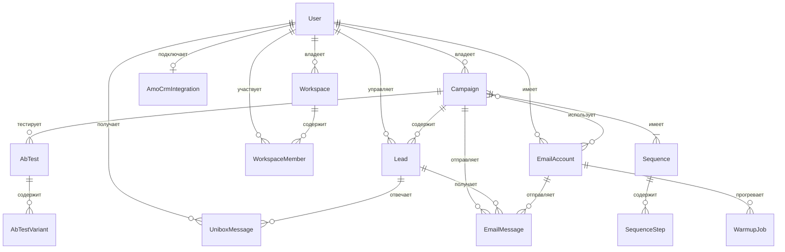
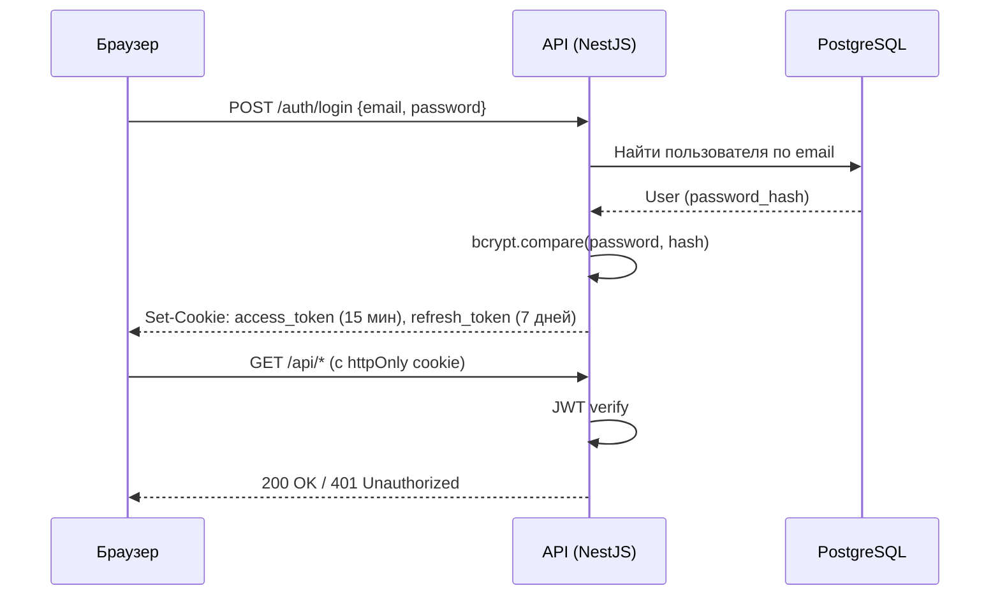
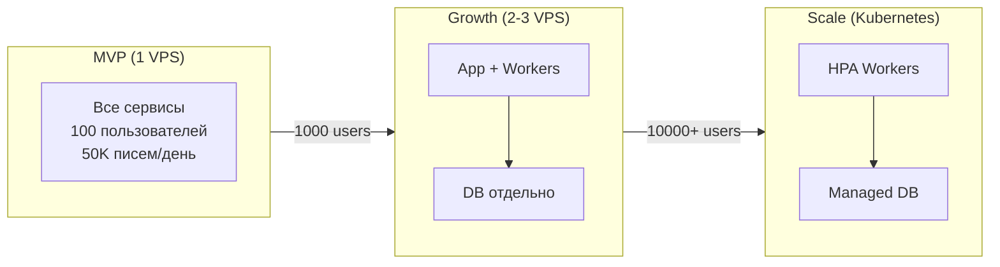

# Архитектура ColdMail.ru

**Версия:** 0.1 | **Дата:** 2026-04-29 | **Стиль:** Distributed Monolith (Monorepo)

---

## Общая архитектура системы



---

## Technology Stack

| Слой | Технология | Версия | Обоснование |
|------|-----------|--------|-------------|
| Frontend | React + Next.js | 18 / 14 | Компонентная модель, App Router |
| Стилизация | Tailwind CSS | 3.4 | Utility-first, токены тёмной темы |
| Состояние | Zustand + React Query | Latest | Лёгкий стейт + серверный кеш |
| Формы | React Hook Form + Zod | Latest | Валидация с TypeScript |
| Графики | Recharts | Latest | Лёгкая библиотека графиков |
| Backend | NestJS (Node.js) | 10 / 20 LTS | TypeScript, модульность, DI |
| ORM | Prisma | 5.x | Type-safe, миграции |
| Очереди | BullMQ | Latest | Redis-backed, надёжные задачи |
| База данных | PostgreSQL | 16 | ACID, JSON, full-text search |
| Кеш/Очереди | Redis | 7.x | BullMQ, кеширование, rate limiting |
| Email | Nodemailer | 6.x | Зрелый SMTP-клиент |
| IMAP | imapflow | 1.x | Современный IMAP-клиент |
| AI | OpenAI SDK | 4.x | GPT-4o-mini для генерации |
| Auth | JWT + bcrypt | -- | Stateless аутентификация |
| Proxy | Nginx | 1.25 | TLS, rate limiting, статика |
| Контейнеры | Docker + Compose | 24 / 2.x | Оркестрация, 152-ФЗ VPS |
| Мониторинг | Prometheus + Grafana | Latest | Self-hosted метрики |
| Логирование | Pino + Loki | Latest | Структурированные JSON-логи |
| CI/CD | GitHub Actions | -- | Автодеплой на push в main |

---

## NestJS-модули (16)

```
src/
├── auth/          # JWT, login, register, refresh tokens
├── accounts/      # Email-аккаунты CRUD, тестирование подключения
├── campaigns/     # Жизненный цикл кампаний, расписание
├── sequences/     # Шаги sequence, рендеринг шаблонов
├── leads/         # Управление лидами, импорт CSV, статусы
├── warmup/        # Движок прогрева, выбор пиров
├── email/         # SMTP-отправка, IMAP-проверка, deliverability
├── ai/            # Интеграция OpenAI, управление промптами
├── unibox/        # Агрегация ответов, управление тредами
├── analytics/     # Расчёт метрик, временные ряды
├── compliance/    # Проверка 38-ФЗ, управление отписками
├── workspace/     # Рабочие пространства, приглашения
├── amocrm/        # Интеграция AmoCRM (OAuth, синхронизация)
├── ab-testing/    # A/B тестирование тем и тел писем
├── common/        # Шифрование, логирование, ошибки
└── health/        # Health check endpoint
```

---

## BullMQ-воркеры (7 очередей)

| Очередь | Назначение | Concurrency | Расписание |
|---------|-----------|:-----------:|-----------|
| `email:send` | Отправка писем кампаний | 5 | По требованию (scheduler) |
| `email:schedule` | Расчёт следующего батча | 1 | Каждые 5 мин (cron) |
| `warmup:run` | Управление warmup-взаимодействиями | 3 | Ежедневно 08:00 MSK |
| `warmup:send` | Отправка warmup-писем | 5 | По требованию |
| `imap:check` | Проверка входящих (ответы/bounce) | 3 | Каждые 2 мин |
| `ai:generate` | Пакетная AI-персонализация | 2 | По требованию |
| `analytics:update` | Пересчёт метрик кампаний | 1 | Каждые 10 мин |

---

## Схема базы данных PostgreSQL (16 моделей)



### Основные модели

| Модель | Таблица | Описание |
|--------|---------|----------|
| User | users | Пользователи системы |
| EmailAccount | email_accounts | Подключённые email-ящики |
| Campaign | campaigns | Рассылочные кампании |
| CampaignAccount | campaign_accounts | Связь кампаний с аккаунтами (M:N) |
| Lead | leads | Контакты для рассылки |
| Sequence | sequences | Цепочки писем |
| SequenceStep | sequence_steps | Шаги в цепочке |
| EmailMessage | email_messages | Отправленные письма |
| WarmupJob | warmup_jobs | Задачи прогрева |
| UniboxMessage | unibox_messages | Входящие ответы |
| AmoCrmIntegration | amocrm_integrations | Подключение AmoCRM |
| AbTest | ab_tests | A/B тесты |
| AbTestVariant | ab_test_variants | Варианты A/B тестов |
| Workspace | workspaces | Рабочие пространства |
| WorkspaceMember | workspace_members | Участники пространств |

### Ключевые индексы

| Таблица | Индекс | Назначение |
|---------|--------|------------|
| leads | (campaign_id, status, next_send_at) | Запрос планировщика |
| email_messages | (campaign_id, status) | Агрегация аналитики |
| email_accounts | (user_id, warmup_status) | Листинг аккаунтов |
| unibox_messages | (user_id, read, received_at) | Листинг входящих |

---

## Redis: кеш и очереди

| Назначение | Паттерн ключей | TTL |
|-----------|---------------|-----|
| Blacklist JWT | `auth:blacklist:{token_id}` | 15 мин |
| Rate limiting | `ratelimit:{user_id}:{endpoint}` | 1 мин |
| Счётчик отправки | `account:{id}:sent_today` | Сброс в полночь |
| Кеш метрик | `analytics:{campaign_id}` | 10 мин |
| Очереди BullMQ | `bull:{queue_name}:*` | Без TTL |

---

## Безопасность

### Аутентификация



### Шифрование данных

| Данные | At Rest | In Transit |
|--------|---------|-----------|
| Пароли пользователей | bcrypt (12 rounds) | TLS 1.3 |
| SMTP/IMAP-учётные данные | AES-256-GCM | TLS 1.3 |
| Email-контент | Plain (PostgreSQL) | TLS 1.3 |
| PII лидов | Plain (сервер в РФ = compliant) | TLS 1.3 |
| JWT-токены | -- | TLS 1.3 |

### Rate Limiting

| Endpoint | Лимит | Окно | Действие |
|----------|-------|------|----------|
| POST /auth/login | 5 попыток | 15 мин | Блокировка IP |
| POST /auth/register | 3 | 1 час | Блокировка IP |
| POST /ai/* | 30 | 1 мин | 429 ответ |
| GET /api/* | 100 | 1 мин | 429 ответ |

---

## Масштабирование

### Горизонтальное масштабирование



### Узкие места и решения

| Узкое место | Порог | Решение |
|-------------|-------|---------|
| SMTP rate | 50/аккаунт/день (Yandex) | Больше аккаунтов, ротация IP |
| IMAP-проверка | 2 мин x N аккаунтов | Пакетная обработка |
| AI-генерация | 10с на письмо | Предварительная пакетная генерация |
| PostgreSQL | 100 соединений | PgBouncer connection pooling |
| Redis | 1 GB на очереди | TTL ключей, cleanup-задачи |
