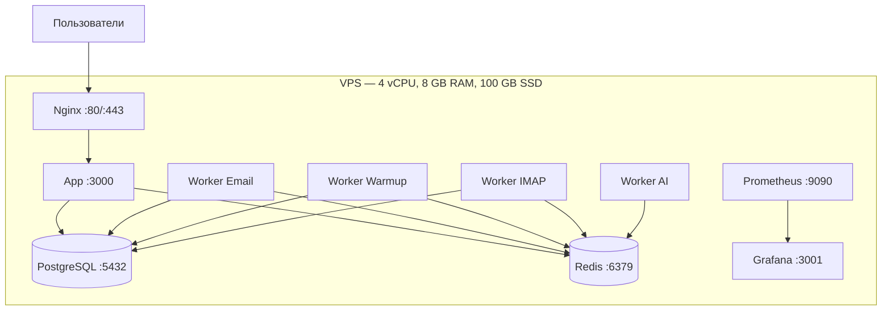
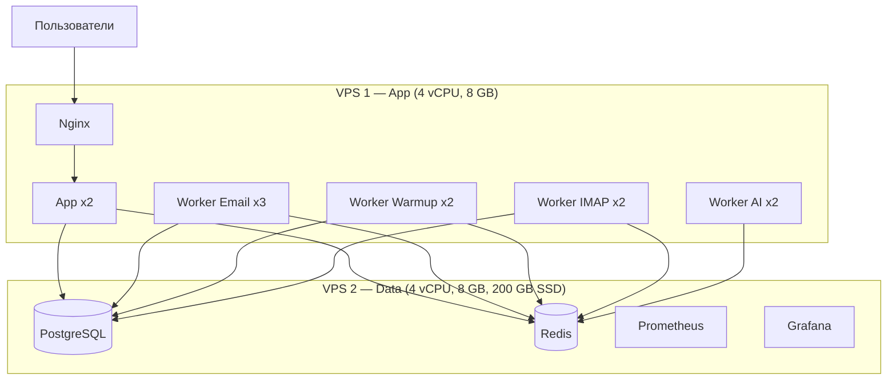
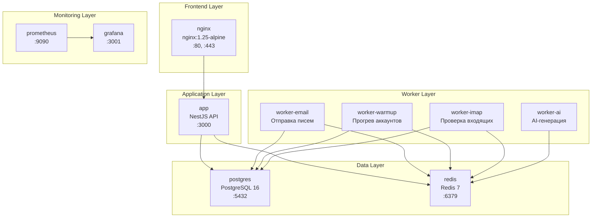

# Инфраструктура ColdMail.ru

**Версия:** 0.1 | **Дата:** 2026-04-29

---

## Этапы масштабирования

### MVP: 1 VPS (до 100 пользователей)



| Параметр | Значение |
|----------|---------|
| Сервер | 1 VPS (AdminVPS / HOSTKEY) |
| CPU | 4 vCPU |
| RAM | 8 GB |
| Диск | 100 GB SSD |
| ОС | Ubuntu 22.04 LTS |
| Ёмкость | ~100 пользователей, 50 000 писем/день |
| Локация | Москва / Санкт-Петербург (152-ФЗ) |

### Growth: 2-3 VPS (до 1 000 пользователей)



| Параметр | Значение |
|----------|---------|
| Серверы | 2-3 VPS |
| App-сервер | 4 vCPU, 8 GB RAM |
| Data-сервер | 4 vCPU, 8 GB RAM, 200 GB SSD |
| Ёмкость | ~1 000 пользователей, 500 000 писем/день |
| Изменения | Вынос БД на отдельный сервер, реплики воркеров |

### Scale: Kubernetes (10 000+ пользователей)

| Параметр | Значение |
|----------|---------|
| Платформа | Yandex Cloud / Selectel Kubernetes |
| База данных | Managed PostgreSQL (Yandex MDB) |
| Кеш | Managed Redis |
| Автоскейлинг | HPA для воркеров по глубине очередей |
| Ёмкость | 10 000+ пользователей, 5 000 000 писем/день |

---

## Сетевые порты

| Порт | Сервис | Протокол | Доступ |
|------|--------|----------|--------|
| 80 | Nginx (HTTP -> HTTPS redirect) | TCP | Публичный |
| 443 | Nginx (HTTPS) | TCP | Публичный |
| 3000 | NestJS API | TCP | Внутренний (за Nginx) |
| 3001 | Grafana | TCP | Внутренний / VPN |
| 5432 | PostgreSQL | TCP | Внутренний |
| 6379 | Redis | TCP | Внутренний |
| 9090 | Prometheus | TCP | Внутренний |

### Рекомендации по firewall

```bash
# Разрешить только HTTP/HTTPS извне
sudo ufw allow 80/tcp
sudo ufw allow 443/tcp
sudo ufw allow 22/tcp    # SSH
sudo ufw deny 5432/tcp   # PostgreSQL — только внутренний
sudo ufw deny 6379/tcp   # Redis — только внутренний
sudo ufw deny 9090/tcp   # Prometheus — только внутренний
sudo ufw enable
```

---

## Docker Compose: 11 сервисов



### Описание сервисов

| Сервис | Образ | Назначение | Зависимости |
|--------|-------|------------|-------------|
| nginx | nginx:1.25-alpine | Reverse proxy, TLS, статика | app |
| app | Dockerfile (NestJS) | REST API, бизнес-логика | postgres, redis |
| worker-email | Dockerfile | Отправка писем через SMTP | postgres, redis |
| worker-warmup | Dockerfile | Warmup-взаимодействия | postgres, redis |
| worker-imap | Dockerfile | Проверка IMAP (ответы, bounce) | postgres, redis |
| worker-ai | Dockerfile | AI-генерация через OpenAI | redis |
| postgres | postgres:16-alpine | Основная БД (16 моделей) | -- |
| redis | redis:7-alpine | Очереди BullMQ + кеш | -- |
| prometheus | prom/prometheus:v2.51.0 | Сбор метрик | -- |
| grafana | grafana/grafana:10.4.0 | Визуализация метрик | prometheus |
| loki | grafana/loki | Агрегация логов | -- |

### Volumes (постоянное хранилище)

| Volume | Сервис | Содержимое |
|--------|--------|-----------|
| postgres_data | postgres | Данные БД |
| redis_data | redis | RDB-снапшоты и AOF |
| prometheus_data | prometheus | Метрики (TSDB) |
| grafana_data | grafana | Дашборды и настройки |

---

## Внешние API и сервисы

| Сервис | Протокол | Направление | Назначение |
|--------|----------|-------------|------------|
| Yandex.Mail | SMTP (465) / IMAP (993) | Двунаправленный | Отправка и получение писем |
| Mail.ru | SMTP (465) / IMAP (993) | Двунаправленный | Отправка и получение писем |
| Custom SMTP | SMTP / IMAP | Двунаправленный | Пользовательские почтовые серверы |
| OpenAI API | HTTPS | Исходящий | AI-генерация писем (GPT-4o-mini) |
| Let's Encrypt | HTTPS | Исходящий | Выпуск TLS-сертификатов |
| GitHub | HTTPS / SSH | Исходящий | CI/CD, управление кодом |

### Расход трафика (оценка MVP)

| Направление | Объём/мес | Примечание |
|-------------|----------|------------|
| SMTP исходящий | ~5 GB | 50 000 писем/день * 30 дней |
| IMAP входящий | ~2 GB | Проверка ответов каждые 2 мин |
| OpenAI API | ~500 MB | AI-генерация 10 000 писем/мес |
| HTTP пользователи | ~10 GB | SPA + API-запросы |

---

## Резервирование и отказоустойчивость

### MVP (1 VPS)

| Компонент | Стратегия |
|-----------|----------|
| PostgreSQL | Ежедневный pg_dump + WAL-архивация |
| Redis | RDB каждый час + AOF |
| Приложение | Docker restart policy: `unless-stopped` |
| Health check | app: каждые 30с, postgres: каждые 10с, redis: каждые 10с |

### Целевые показатели

| Метрика | MVP | Production |
|---------|-----|------------|
| SLA Uptime | 99.5% | 99.9% |
| RTO (время восстановления) | 4 часа | 1 час |
| RPO (допустимая потеря данных) | 1 час | 15 минут |

---

## Требования к серверу по этапам

| Этап | Серверы | CPU | RAM | Диск | Писем/день |
|------|---------|-----|-----|------|-----------|
| MVP | 1 VPS | 4 vCPU | 8 GB | 100 GB | 50 000 |
| Growth | 2-3 VPS | 8-12 vCPU | 16-24 GB | 300 GB | 500 000 |
| Scale | Kubernetes | Auto | Auto | Managed | 5 000 000 |
