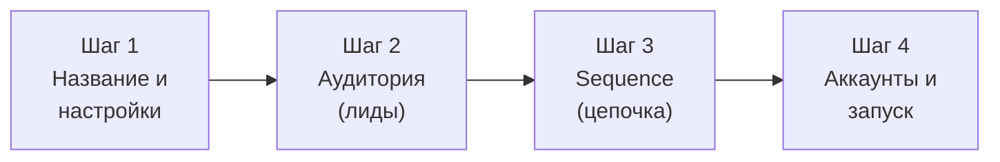

# Интерфейс ColdMail.ru

**Версия:** 0.1 | **Дата:** 2026-04-29

---

## Layout (структура интерфейса)

```
+----+------------------------+-------------------------------------+
| IC |   Secondary Sidebar    |           Content Area              |
| ON |      (w-72 / 288px)    |                                     |
|    |                        |                                     |
| SI |   Контекстное меню     |   Основное содержимое экрана       |
| DE |   текущего раздела     |                                     |
| BA |                        |                                     |
| R  |                        |                                     |
|    |                        |                                     |
| w  |                        |                                     |
| 16 |                        |                                     |
+----+------------------------+-------------------------------------+
```

### Icon Sidebar (w-16 / 64px)

Узкая боковая панель слева, фиксированная. Содержит иконки основных разделов:

- Dashboard (обзор)
- Campaigns (кампании)
- Accounts (email-аккаунты)
- Unibox (входящие ответы)
- Analytics (аналитика)
- AI Generator (AI-генерация)
- Settings (настройки)
- Аватар / профиль (внизу)

### Secondary Sidebar (w-72 / 288px)

Контекстное меню, зависящее от выбранного раздела. Показывает вложенные элементы: список кампаний, фильтры, подразделы настроек.

### Content Area

Основная рабочая область, занимающая оставшееся пространство.

---

## Dark Theme: цветовая палитра

| Элемент | Значение | Использование |
|---------|---------|---------------|
| Фон основной | `#0f1014` | Фон страницы |
| Фон панели/карточки | `#15171c` | Карточки, sidebar |
| Фон третичный | `#17191f` | Вложенные блоки |
| Фон инпута | `#111318` | Поля ввода |
| Граница | `#2a2d34` | Границы карточек, разделители |
| Граница (hover) | `#3a3d44` | Состояние наведения |
| Primary (синий) | `#2563eb` | Кнопки, ссылки, акценты |
| Primary hover | `#3b82f6` | Состояние наведения |
| Градиент | `#2563eb` -> `#7c3aed` | AI-кнопки, спец. акценты |
| Success (зелёный) | `#22c55e` | Активный статус, успех |
| Warning (жёлтый) | `#facc15` | Предупреждения, пауза |
| Error (красный) | `#ef4444` | Ошибки, bounce |
| Текст основной | `#e5e7eb` | Заголовки, контент |
| Текст вторичный | `#9ca3af` | Подписи, метки |
| Текст приглушённый | `#8b949e` | Заголовки таблиц, хинты |

### Типографика

| Параметр | Значение |
|----------|---------|
| Шрифт | Inter, system-ui, sans-serif |
| XS | 11px |
| SM | 13px |
| Base | 14px |
| LG | 16px |
| XL | 20px |
| 2XL | 24px |
| 3XL | 28px |

### Скругления

| Элемент | Значение |
|---------|---------|
| Кнопки | rounded-xl (12px) |
| Карточки | rounded-2xl (16px) |
| Инпуты | rounded-xl (12px) |
| Бейджи | rounded-md (8px) |

---

## Экраны

### Dashboard

Обзорный экран с основными метриками.

| Элемент | Описание |
|---------|----------|
| KPI-карточки | Отправлено, открыто, отвечено, bounce за период |
| Активные кампании | Список с прогрессом и статусом |
| Warmup-статус | Прогресс прогрева подключённых аккаунтов |
| Последняя активность | Таймлайн недавних событий |
| EmptyState | Подсказки для нового пользователя с CTA |

### Accounts (Email-аккаунты)

| Элемент | Описание |
|---------|----------|
| Таблица аккаунтов | Email, провайдер, статус, health score, warmup |
| Health Score | Числовой индикатор 0-100 с цветовой кодировкой |
| Warmup-иконка | Пламя с прогресс-баром |
| Кнопка "Добавить" | Открывает модальное окно подключения |
| StatusBadge | Connected (зелёный), Error (красный), Disconnected (серый) |

### Campaigns (Кампании)

| Элемент | Описание |
|---------|----------|
| Список кампаний | Название, статус, метрики (sent/opened/replied) |
| StatusBadge | Draft (серый), Active (зелёный), Paused (жёлтый), Completed (синий) |
| Фильтры | По статусу, дате создания |
| Кнопка "Создать" | Запускает Campaign Wizard |

### Campaign Wizard (4 шага)



Прогресс-бар вверху, кнопки "Назад" / "Далее" внизу. На последнем шаге -- сводка и "Запустить".

### AI Generator

| Элемент | Описание |
|---------|----------|
| PromptInput | Большое текстовое поле по центру для описания продукта |
| Тон | Селектор: Формальный / Неформальный / Креативный |
| Кнопка "Сгенерировать" | Градиентная кнопка (blue -> violet) |
| Превью | Сгенерированное письмо с возможностью редактирования |
| Копирование | Кнопка для копирования в sequence |

### Unibox

Трёхколоночный layout:

```
+------------------+---------------------+------------------------+
|    Фильтры       |   Список писем      |   Панель чтения        |
|                  |                     |                        |
| - По статусу     | - Имя лида          | - Полный текст         |
| - По кампании    | - Тема              | - Кнопка "Ответить"    |
| - По аккаунту    | - Превью            | - Смена статуса лида   |
| - Прочитано/нет  | - Время получения   |                        |
+------------------+---------------------+------------------------+
```

### Analytics

| Элемент | Описание |
|---------|----------|
| KPI-карточки | Sent, Opened, Replied, Bounced с процентами |
| Area Chart | График динамики метрик за период (Recharts) |
| Фильтры | По кампании, по периоду (день/неделя/месяц) |
| Таблица кампаний | Сравнение метрик между кампаниями |

### Settings (Настройки)

Подразделы в Secondary Sidebar:

- **Profile** -- имя, email, пароль
- **Workspace** -- название, участники (owner only)
- **Integrations** -- AmoCRM
- **Billing** -- тариф, оплата (owner only)

---

## Библиотека компонентов

### Button (Кнопка)

| Вариант | Tailwind-классы |
|---------|----------------|
| Primary | `rounded-xl px-4 py-2 font-semibold bg-blue-600 hover:bg-blue-500 text-white` |
| Secondary | `rounded-xl px-4 py-2 font-semibold bg-white/10 hover:bg-white/15 text-gray-200` |
| Gradient | `rounded-xl px-4 py-2 font-semibold bg-gradient-to-r from-blue-600 to-violet-600 text-white` |
| Danger | `rounded-xl px-4 py-2 font-semibold bg-red-600 hover:bg-red-500 text-white` |

### Card (Карточка)

```
rounded-2xl border border-[#2a2d34] bg-[#15171c] p-6
```

### Input (Поле ввода)

```
bg-[#111318] border border-[#2a2d34] rounded-xl h-12 px-4 text-sm
```

### Badge (Бейдж)

| Вариант | Классы |
|---------|--------|
| Success | `rounded-md px-2 py-1 text-xs font-semibold bg-emerald-500/20 text-emerald-300` |
| Warning | `bg-yellow-500/20 text-yellow-300` |
| Error | `bg-red-500/20 text-red-300` |
| Info | `bg-blue-500/20 text-blue-300` |

### Table (Таблица)

| Элемент | Классы |
|---------|--------|
| Header | `uppercase text-xs text-[#8b949e] tracking-wider` |
| Row | `border-b border-[#2a2d34] hover:bg-white/5` |
| Cell | `px-4 py-3 text-sm text-[#e5e7eb]` |

### EmptyState (Пустое состояние)

```
flex min-h-[420px] flex-col items-center justify-center text-center text-slate-400
```

Содержит иконку, заголовок, описание и CTA-кнопку для первого действия пользователя.

### WarmupHealthIndicator

Иконка пламени с прогресс-баром и числовым значением inbox rate. Цвет пламени зависит от статуса:
- Серый -- не начат
- Оранжевый с анимацией -- в процессе
- Зелёный -- готов

### Modal (Модальное окно)

Центрированное окно с затемнённым фоном (`bg-black/50`). Карточка с заголовком, контентом и кнопками действий.
