# Пользовательские сценарии ColdMail.ru

**Версия:** 0.1 | **Дата:** 2026-04-29

---

## Основной путь пользователя

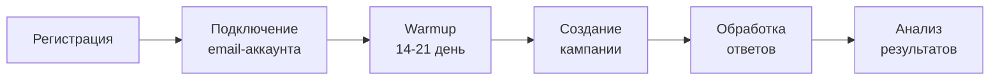

---

## Сценарий 1: Регистрация и онбординг

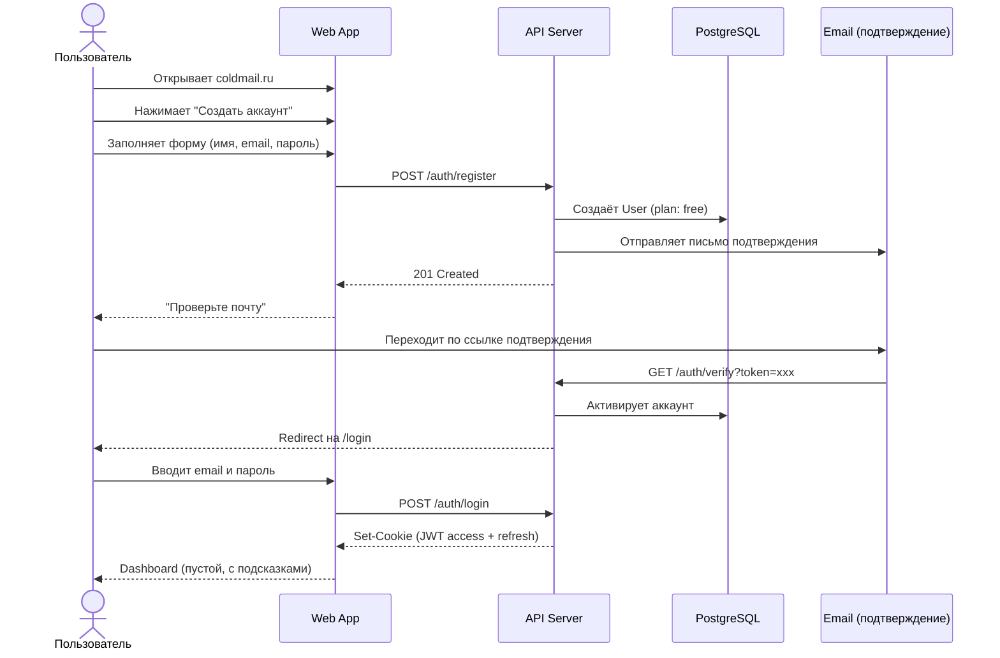

**Время:** ~3 минуты

**Результат:** пользователь авторизован, видит пустой Dashboard с EmptyState-подсказками.

---

## Сценарий 2: Подключение email-аккаунта

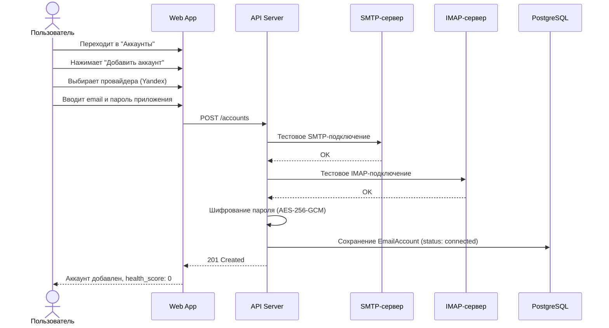

**Время:** ~2 минуты

**Результат:** email-аккаунт подключён, отображается в списке со статусом "Connected".

---

## Сценарий 3: Warmup (прогрев аккаунта)

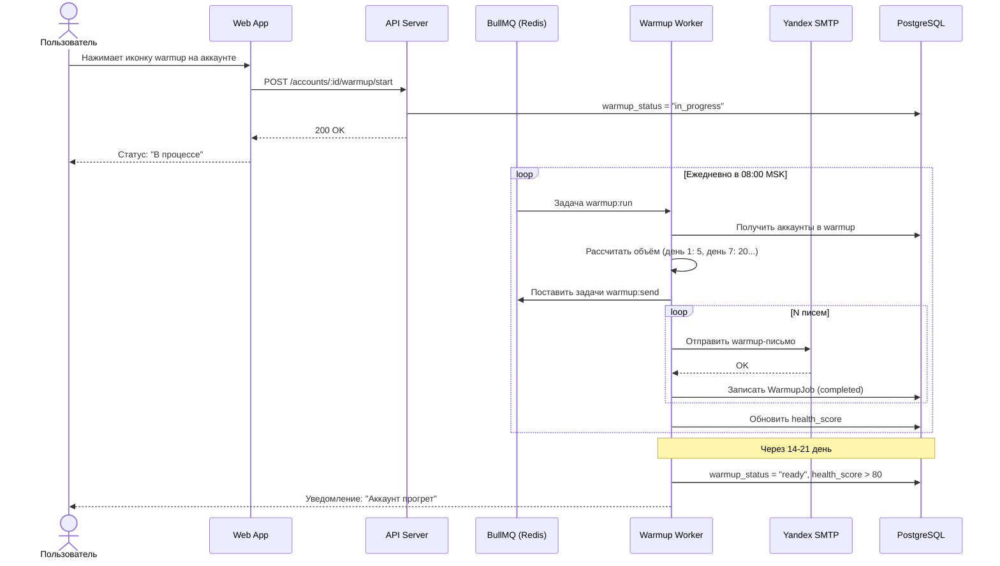

**Время:** 14-21 день (автоматический фоновый процесс)

**Результат:** health_score > 80, inbox rate > 85%, аккаунт готов к рассылке.

---

## Сценарий 4: Создание и запуск кампании

```mermaid
sequenceDiagram
    actor U as Пользователь
    participant W as Web App
    participant API as API Server
    participant AI as AI Worker
    participant DB as PostgreSQL
    participant Q as BullMQ

    rect rgb(30, 30, 50)
        Note over U,W: Шаг 1: Название и настройки
        U->>W: Нажимает "Создать кампанию"
        U->>W: Вводит название, расписание, дневной лимит
    end

    rect rgb(30, 50, 30)
        Note over U,W: Шаг 2: Импорт лидов
        U->>W: Загружает CSV-файл
        W->>API: POST /campaigns/:id/leads (multipart)
        API->>API: Парсинг CSV (UTF-8, BOM)
        API->>DB: Создание Lead записей
        API-->>W: Импортировано N лидов
    end

    rect rgb(50, 30, 30)
        Note over U,AI: Шаг 3: Sequence
        U->>W: Создаёт шаг 1 (тема + тело)
        U->>W: Включает AI-персонализацию
        U->>W: Добавляет follow-up (шаг 2, задержка 3 дня)
        W->>API: POST /sequences
        API->>DB: Создание Sequence + SequenceSteps
    end

    rect rgb(30, 30, 30)
        Note over U,W: Шаг 4: Аккаунты и запуск
        U->>W: Выбирает 3 прогретых аккаунта
        U->>W: Нажимает "Запустить"
        W->>API: POST /campaigns/:id/start
        API->>DB: status = "active"
        API->>Q: Поставить в очередь email:schedule
    end

    API-->>W: Кампания запущена
    W-->>U: StatusBadge: Active (зелёный)
```

**Время:** ~10-15 минут

**Результат:** кампания активна, планировщик начинает формировать очереди на отправку.

---

## Сценарий 5: Отправка писем (фоновый процесс)

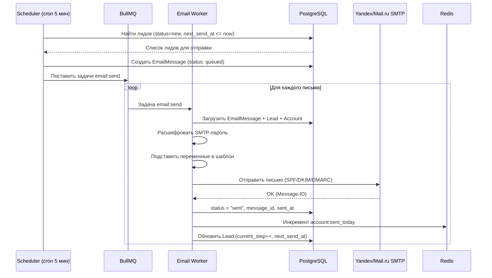

---

## Сценарий 6: Получение ответа и обработка

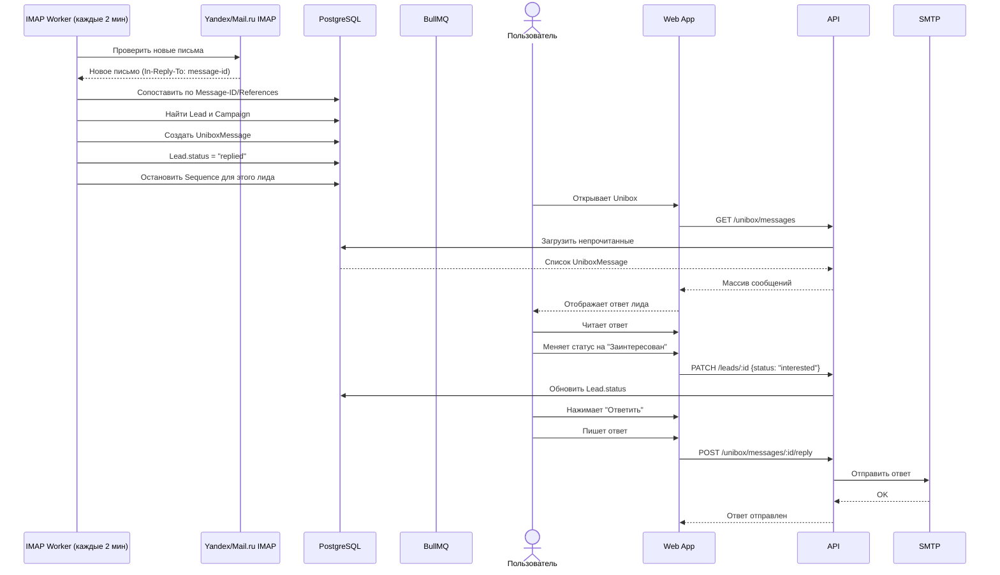

**Время:** проверка каждые 2 минуты, обработка пользователем -- индивидуально.

---

## Сценарий 7: AI-генерация письма

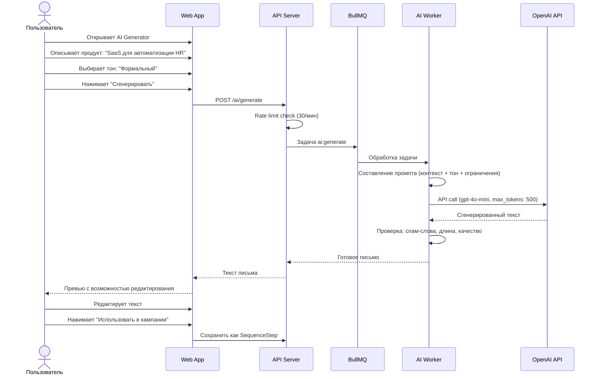

**Время:** 5-10 секунд на генерацию.

---

## Сценарий 8: Полный цикл (Time to Value)

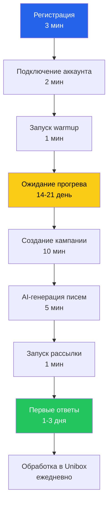

### Ключевые метрики Time to Value

| Этап | Целевое время |
|------|--------------|
| Регистрация -> Dashboard | 3 минуты |
| Dashboard -> Аккаунт подключён | 5 минут |
| Аккаунт -> Warmup запущен | 6 минут |
| Warmup завершён -> Кампания запущена | 15 минут |
| Общий time-to-first-campaign | < 15 минут (без warmup) |

---

## Сценарий ошибки: SMTP-подключение не удалось

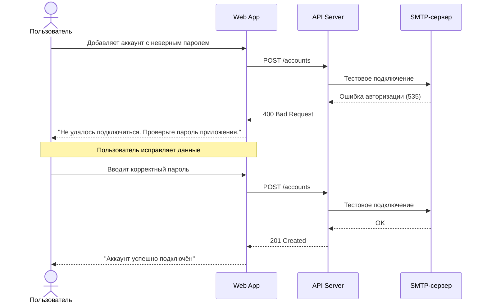

---

## Сценарий: Пауза и возобновление кампании

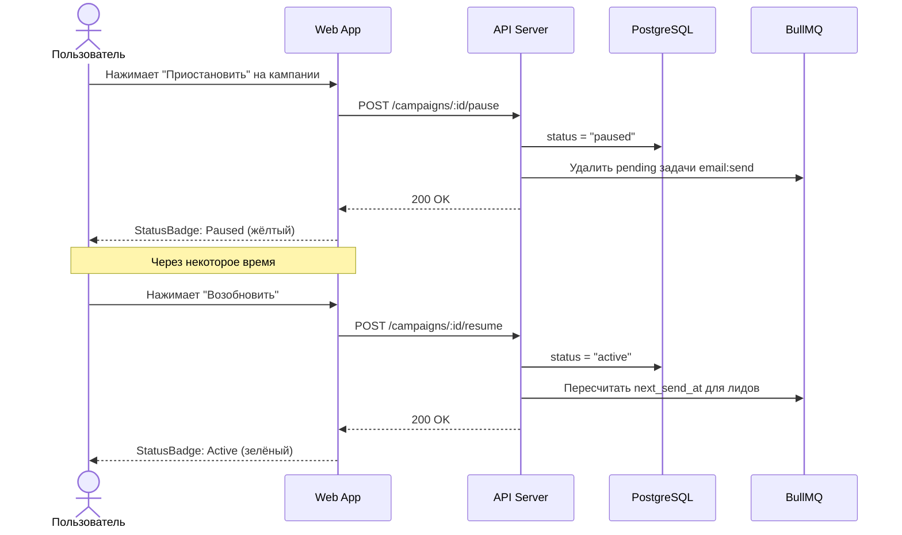
