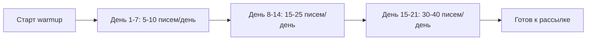

# Руководство пользователя ColdMail.ru

**Версия:** 0.1 | **Дата:** 2026-04-29

---

## Начало работы

### Регистрация

1. Откройте `https://coldmail.ru`
2. Нажмите **Создать аккаунт**
3. Заполните форму: имя, фамилия, email, пароль
4. Подтвердите email (ссылка в письме)
5. Войдите в систему

После регистрации вы попадаете на **Dashboard** с пустыми карточками-метриками и подсказками для быстрого старта.

### Тарифные планы

| План | Цена | Аккаунты | Лиды | AI-генерация |
|------|------|----------|------|-------------|
| Free | 0 Р/мес | 1 | 100 | 10 писем |
| Growth | 2 990 Р/мес | 5 | 5 000 | 500 писем |
| Pro | 5 990 Р/мес | 25 | 25 000 | Без лимита |
| Agency | 14 990 Р/мес | Безлимит | 100 000 | Без лимита |

---

## Подключение email-аккаунтов

### Yandex.Mail

1. Перейдите в раздел **Аккаунты** (иконка конверта в боковой панели)
2. Нажмите **Добавить аккаунт**
3. Выберите провайдера **Yandex**
4. Введите email и пароль приложения (не основной пароль)
5. Система автоматически проверит SMTP и IMAP подключение

> **Важно:** в настройках Yandex.Mail необходимо создать пароль приложения: Yandex ID -> Безопасность -> Пароли приложений.

### Mail.ru

1. Нажмите **Добавить аккаунт** -> **Mail.ru**
2. Введите email и пароль приложения
3. Для создания пароля: Mail.ru -> Настройки -> Безопасность -> Пароли для внешних приложений

### Custom SMTP

1. Нажмите **Добавить аккаунт** -> **Custom SMTP**
2. Заполните параметры:
   - SMTP-хост, порт, логин, пароль
   - IMAP-хост, порт
3. Нажмите **Проверить подключение**
4. При успешной проверке нажмите **Сохранить**

### Health Score аккаунта

Каждый аккаунт отображает Health Score (0-100):

| Оценка | Значение | Цвет |
|--------|----------|------|
| 80-100 | Отлично, готов к рассылке | Зелёный |
| 50-79 | Средний, рекомендуется warmup | Жёлтый |
| 0-49 | Низкий, требуется прогрев | Красный |

---

## Warmup (прогрев аккаунтов)

### Зачем нужен warmup

Новый email-аккаунт не имеет репутации у почтовых провайдеров. Без прогрева письма будут попадать в спам. Warmup постепенно увеличивает объём отправки и создаёт положительную историю.

### Запуск warmup

1. В разделе **Аккаунты** найдите нужный аккаунт
2. Нажмите иконку пламени (warmup)
3. Подтвердите запуск

### Процесс прогрева

- Средняя длительность: 14-21 день
- Система автоматически обменивается письмами с пулом warmup-аккаунтов
- Входящие warmup-письма помечаются как "Не спам"
- Вы получите уведомление, когда аккаунт будет готов

### Мониторинг warmup

На карточке аккаунта отображается:
- Статус: `Не начат` / `В процессе` / `Готов` / `Приостановлен`
- Inbox Rate -- процент писем во входящих (цель: > 85%)
- Количество дней с начала прогрева

---

## Создание кампании

Кампания создаётся через пошаговый мастер (wizard) из 4 шагов.

### Шаг 1: Название и настройки

- Введите название кампании (например, "Outreach IT-директоров Q2")
- Выберите расписание отправки (рабочие дни, часовой пояс)
- Укажите дневной лимит отправки

### Шаг 2: Аудитория (лиды)

- **Импорт CSV**: загрузите файл с колонками email, имя, фамилия, компания, должность, индустрия
- **Ручное добавление**: заполните форму для каждого лида
- Поддерживаемые переменные: `{{first_name}}`, `{{last_name}}`, `{{company}}`, `{{title}}`, `{{industry}}`

> **Формат CSV:** UTF-8, разделитель -- запятая или точка с запятой. Система автоматически обрабатывает BOM и русские названия колонок.

### Шаг 3: Sequence (цепочка писем)

Создайте от 1 до 5 шагов в цепочке:

| Параметр | Описание |
|----------|----------|
| Тема | Тема письма (поддерживает переменные) |
| Тело | Текст письма (HTML или plain text) |
| Задержка | Интервал перед отправкой (1-14 дней) |
| AI-персонализация | Включить AI-адаптацию под каждого лида |

### Шаг 4: Email-аккаунты и запуск

- Выберите аккаунты для отправки (рекомендуется 3-5 прогретых)
- Просмотрите сводку кампании
- Нажмите **Запустить кампанию**

---

## AI-генерация писем

### Создание письма с помощью AI

1. Перейдите в раздел **AI Generator** (иконка искусственного интеллекта)
2. Опишите ваш продукт/услугу в текстовом поле
3. Выберите тон письма:
   - **Формальный** -- деловой стиль, обращение на "Вы"
   - **Неформальный** -- дружелюбный, обращение на "ты"
   - **Креативный** -- нестандартный подход, метафоры
4. Нажмите **Сгенерировать**
5. Получите персонализированный шаблон за 5-10 секунд

### AI-персонализация в sequences

При включённой AI-персонализации система адаптирует каждое письмо под конкретного лида, используя:

- Имя и должность лида
- Название и отрасль компании
- Контекст вашего продукта

### Редактирование AI-текста

Сгенерированный текст всегда можно отредактировать вручную. AI предлагает черновик -- финальное решение за вами.

---

## Unibox (единый почтовый ящик)

### Обзор

Unibox собирает ответы лидов со всех подключённых email-аккаунтов в единый интерфейс.

### Интерфейс Unibox

Экран разделён на 3 колонки:

1. **Фильтры** (левая панель): фильтрация по статусу, кампании, аккаунту
2. **Список сообщений** (центр): превью писем с именем лида и темой
3. **Чтение** (правая панель): полный текст письма и возможность ответить

### Статусы лидов

| Статус | Описание |
|--------|----------|
| Новый | Ответ ещё не обработан |
| Заинтересован | Лид проявил интерес |
| Встреча назначена | Договорились о встрече |
| Выигран | Сделка состоялась |
| Не заинтересован | Лид отказался |

Смена статуса -- вручную, одним кликом из панели чтения.

---

## Аналитика

### KPI-карточки

На странице аналитики отображаются основные метрики:

- **Отправлено** -- общее количество отправленных писем
- **Открыто** -- писем прочитано (по tracking pixel)
- **Отвечено** -- получены ответы
- **Bounce** -- недоставленные письма

### Фильтрация

- По кампании: сравнение эффективности кампаний
- По периоду: день, неделя, месяц, произвольный диапазон
- По аккаунту: health и warmup-статус каждого ящика

### График

Area chart с динамикой отправки и ответов за выбранный период.

---

## FAQ

**В: Сколько email-аккаунтов можно подключить?**
О: Зависит от тарифа. На Free -- 1, на Agency -- без ограничений.

**В: Как долго длится warmup?**
О: Обычно 14-21 день. Система уведомит, когда аккаунт будет готов.

**В: Безопасно ли хранить пароли от почты в системе?**
О: Да, все пароли шифруются алгоритмом AES-256-GCM. Ключ шифрования хранится отдельно от базы данных.

**В: Можно ли отправлять через Gmail?**
О: MVP-версия оптимизирована для Yandex и Mail.ru. Custom SMTP позволяет подключить любой сервер.

**В: Как избежать попадания в спам?**
О: Используйте warmup перед рассылкой, соблюдайте дневные лимиты, пишите персонализированные письма через AI.

**В: Соответствует ли система 152-ФЗ?**
О: Да, все данные хранятся на серверах в Российской Федерации. Персональные данные лидов обрабатываются в соответствии с законодательством.

**В: Что происходит при ответе лида?**
О: Sequence автоматически останавливается для этого лида. Ответ появляется в Unibox.
