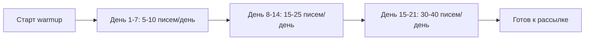

# Руководство пользователя ColdMail.ru

**Версия:** 0.2 | **Дата:** 2026-04-29

---

## Начало работы

### Регистрация и вход

1. Откройте `https://coldmail.ru/login`
2. Если у вас ещё нет аккаунта, нажмите **Создать аккаунт**
3. Заполните форму: имя, фамилия, email, пароль
4. Подтвердите email (ссылка в письме)
5. Войдите в систему, указав email и пароль на странице `/login`

Если вы уже зарегистрированы, просто введите email и пароль на странице входа. Система использует JWT-токены для аутентификации: access-токен (15 минут) и refresh-токен (7 дней). При истечении сессии вы будете перенаправлены на страницу входа автоматически.

После входа вы попадаете на **Dashboard** с пустыми карточками-метриками и подсказками для быстрого старта.

### Тарифные планы

| План | Цена | Аккаунты | Лиды | AI-генерация |
|------|------|----------|------|-------------|
| Free | 0 Р/мес | 1 | 100 | 10 писем |
| Growth | 2 990 Р/мес | 5 | 5 000 | 500 писем |
| Pro | 5 990 Р/мес | 25 | 25 000 | Без лимита |
| Agency | 14 990 Р/мес | Безлимит | 100 000 | Без лимита |

---

## Подключение email-аккаунтов

### Yandex.Mail

1. Перейдите в раздел **Аккаунты** (иконка конверта в боковой панели)
2. Нажмите **Добавить аккаунт**
3. Выберите провайдера **Yandex**
4. Введите email и пароль приложения (не основной пароль)
5. Система автоматически проверит SMTP и IMAP подключение

> **Важно:** в настройках Yandex.Mail необходимо создать пароль приложения: Yandex ID -> Безопасность -> Пароли приложений.

### Mail.ru

1. Нажмите **Добавить аккаунт** -> **Mail.ru**
2. Введите email и пароль приложения
3. Для создания пароля: Mail.ru -> Настройки -> Безопасность -> Пароли для внешних приложений

### Custom SMTP

1. Нажмите **Добавить аккаунт** -> **Custom SMTP**
2. Заполните параметры:
   - SMTP-хост, порт, логин, пароль
   - IMAP-хост, порт
3. Нажмите **Проверить подключение**
4. При успешной проверке нажмите **Сохранить**

### Resend (альтернативный провайдер)

Помимо стандартного SMTP, ColdMail.ru поддерживает отправку через **Resend** -- облачный email API.

1. Перейдите в **Настройки** -> вкладка **Системные**
2. В секции **Email-провайдер** выберите **Resend**
3. Введите **API-ключ Resend** (получите на сайте resend.com)
4. Укажите **From Email** -- адрес отправителя, подтверждённый в Resend
5. Нажмите **Сохранить**
6. Используйте кнопку **Тест** для проверки соединения с Resend API

> **Когда использовать Resend:** если вам не нужны отдельные SMTP-аккаунты (Yandex, Mail.ru) и вы хотите отправлять через единый API с высокой доставляемостью. Resend особенно удобен для технических команд, которые уже используют его в других проектах.

### Health Score аккаунта

Каждый аккаунт отображает Health Score (0-100):

| Оценка | Значение | Цвет |
|--------|----------|------|
| 80-100 | Отлично, готов к рассылке | Зелёный |
| 50-79 | Средний, рекомендуется warmup | Жёлтый |
| 0-49 | Низкий, требуется прогрев | Красный |

---

## Warmup (прогрев аккаунтов)

### Зачем нужен warmup

Новый email-аккаунт не имеет репутации у почтовых провайдеров. Без прогрева письма будут попадать в спам. Warmup постепенно увеличивает объём отправки и создаёт положительную историю.

### Запуск warmup

1. В разделе **Аккаунты** найдите нужный аккаунт
2. Нажмите иконку пламени (warmup)
3. Подтвердите запуск

### Процесс прогрева

- Средняя длительность: 14-21 день
- Система автоматически обменивается письмами с пулом warmup-аккаунтов
- Входящие warmup-письма помечаются как "Не спам"
- Вы получите уведомление, когда аккаунт будет готов

### Мониторинг warmup

На карточке аккаунта отображается:
- Статус: `Не начат` / `В процессе` / `Готов` / `Приостановлен`
- Inbox Rate -- процент писем во входящих (цель: > 85%)
- Количество дней с начала прогрева

---

## Создание кампании

Кампания создаётся через пошаговый мастер (wizard) из 4 шагов. Для начала перейдите в раздел **Кампании** и нажмите **Создать кампанию**.

### Шаг 1: Название

- Введите название кампании (например, "Outreach IT-директоров Q2")
- Название используется только для внутренней навигации и не видно получателям

### Шаг 2: Email-аккаунты для отправки

- Система загрузит список всех подключённых email-аккаунтов
- Отметьте галочками аккаунты, через которые будет идти рассылка
- Рекомендуется выбирать 3-5 прогретых аккаунтов для ротации
- Если аккаунтов нет, сначала подключите хотя бы один в разделе **Аккаунты**

### Шаг 3: Расписание

- **Часовой пояс** -- по умолчанию Europe/Moscow
- **Часы отправки** -- начало и конец рабочего окна (например, 09:00-18:00)
- **Дни недели** -- выберите дни, в которые разрешена отправка (по умолчанию Пн-Пт)
- **Дневной лимит** -- максимальное количество писем в день на кампанию

### Шаг 4: Обзор и запуск

- Просмотрите сводку: название, выбранные аккаунты, расписание, лимиты
- Нажмите **Создать кампанию** для сохранения
- Кампания создаётся в статусе `draft` -- вы сможете добавить лиды и последовательность писем позже на странице кампании

---

## Страница кампании (детали и редактирование)

После создания кампании вы можете открыть её для просмотра и редактирования.

### Метрики кампании

В верхней части страницы отображаются KPI-карточки:

| Метрика | Описание |
|---------|----------|
| Sent | Количество отправленных писем |
| Opens | Количество открытий |
| Replies | Количество ответов |
| Bounced | Количество недоставленных |

### Редактирование настроек

На странице кампании можно изменить:
- **Название** кампании
- **Часы отправки** (начало и конец)
- **Дни недели** для отправки
- **Дневной лимит** писем

Индикатор "Unsaved changes" появляется при любом изменении. Нажмите **Сохранить** для применения.

### Управление статусом

Доступные действия зависят от текущего статуса кампании:

| Действие | Описание |
|----------|----------|
| Start / Resume | Запустить или возобновить отправку |
| Pause | Приостановить отправку |
| Reset stats | Сбросить статистику (sent, opens, replies, bounced) |
| Delete | Удалить кампанию (требует подтверждения) |

### Импорт лидов

На странице кампании есть раздел для управления лидами:
- **Импорт CSV**: загрузите файл с колонками email, имя, фамилия, компания, должность, индустрия
- **Ручное добавление**: заполните форму для каждого лида
- Поддерживаемые переменные: `{{first_name}}`, `{{last_name}}`, `{{company}}`, `{{title}}`, `{{industry}}`

> **Формат CSV:** UTF-8, разделитель -- запятая или точка с запятой. Система автоматически обрабатывает BOM и русские названия колонок.

### Sequence (цепочка писем)

Создайте от 1 до 5 шагов в цепочке:

| Параметр | Описание |
|----------|----------|
| Тема | Тема письма (поддерживает переменные) |
| Тело | Текст письма (HTML или plain text) |
| Задержка | Интервал перед отправкой (1-14 дней) |
| AI-персонализация | Включить AI-адаптацию под каждого лида |

---

## Настройки

Раздел **Настройки** доступен из боковой панели и содержит несколько вкладок.

### Вкладка "Профиль"

Основная информация об аккаунте пользователя.

### Вкладка "Системные"

Управление всеми системными параметрами через веб-интерфейс (без необходимости редактировать `.env` файлы):

**AI (OpenAI):**
- API-ключ OpenAI
- Модель (по умолчанию gpt-4o-mini)
- Максимум токенов на генерацию
- Температура генерации (0-1)

**Расписание отправки (по умолчанию):**
- Часовой пояс
- Начало и конец рабочего окна
- Дневной лимит на аккаунт

**Email-провайдер:**
- Выбор провайдера: **SMTP** или **Resend**
- Для SMTP: хост и порт по умолчанию, тестирование подключения
- Для Resend: API-ключ, адрес отправителя (From Email), тестирование API

**Трекинг:**
- Домен для отслеживания открытий

**Compliance (соответствие):**
- Автоматическая ссылка отписки
- Название компании отправителя
- Контактная информация

### Вкладка "Интеграции"

Настройка интеграций с внешними сервисами (AmoCRM -- запланировано).

### Вкладка "Биллинг"

Управление тарифным планом и оплатой (только для роли owner).

---

## AI-генерация писем

### Создание письма с помощью AI

1. Перейдите в раздел **AI Generator** (иконка искусственного интеллекта)
2. Опишите ваш продукт/услугу в текстовом поле
3. Выберите тон письма:
   - **Формальный** -- деловой стиль, обращение на "Вы"
   - **Неформальный** -- дружелюбный, обращение на "ты"
   - **Креативный** -- нестандартный подход, метафоры
4. Нажмите **Сгенерировать**
5. Получите персонализированный шаблон за 5-10 секунд

### AI-персонализация в sequences

При включённой AI-персонализации система адаптирует каждое письмо под конкретного лида, используя:

- Имя и должность лида
- Название и отрасль компании
- Контекст вашего продукта

### Редактирование AI-текста

Сгенерированный текст всегда можно отредактировать вручную. AI предлагает черновик -- финальное решение за вами.

---

## Unibox (единый почтовый ящик)

### Обзор

Unibox собирает ответы лидов со всех подключённых email-аккаунтов в единый интерфейс.

### Интерфейс Unibox

Экран разделён на 3 колонки:

1. **Фильтры** (левая панель): фильтрация по статусу, кампании, аккаунту
2. **Список сообщений** (центр): превью писем с именем лида и темой
3. **Чтение** (правая панель): полный текст письма и возможность ответить

### Статусы лидов

| Статус | Описание |
|--------|----------|
| Новый | Ответ ещё не обработан |
| Заинтересован | Лид проявил интерес |
| Встреча назначена | Договорились о встрече |
| Выигран | Сделка состоялась |
| Не заинтересован | Лид отказался |

Смена статуса -- вручную, одним кликом из панели чтения.

---

## Аналитика

### KPI-карточки

На странице аналитики отображаются основные метрики:

- **Отправлено** -- общее количество отправленных писем
- **Открыто** -- писем прочитано (по tracking pixel)
- **Отвечено** -- получены ответы
- **Bounce** -- недоставленные письма

### Фильтрация

- По кампании: сравнение эффективности кампаний
- По периоду: день, неделя, месяц, произвольный диапазон
- По аккаунту: health и warmup-статус каждого ящика

### График

Area chart с динамикой отправки и ответов за выбранный период.

---

## FAQ

**В: Сколько email-аккаунтов можно подключить?**
О: Зависит от тарифа. На Free -- 1, на Agency -- без ограничений.

**В: Как долго длится warmup?**
О: Обычно 14-21 день. Система уведомит, когда аккаунт будет готов.

**В: Безопасно ли хранить пароли от почты в системе?**
О: Да, все пароли шифруются алгоритмом AES-256-GCM. Ключ шифрования хранится отдельно от базы данных.

**В: Можно ли отправлять через Gmail?**
О: MVP-версия оптимизирована для Yandex и Mail.ru. Custom SMTP позволяет подключить любой сервер.

**В: Чем Resend отличается от SMTP?**
О: SMTP -- это протокол, при котором вы используете учётные данные конкретного почтового ящика (Yandex, Mail.ru и т.д.). Resend -- это облачный API-сервис для отправки email, который не требует настройки SMTP-серверов. Выбирайте SMTP для рассылок от имени конкретных сотрудников, Resend -- для централизованной отправки через API.

**В: Как настроить системные переменные?**
О: Все системные параметры (AI, расписание, провайдер, трекинг, compliance) настраиваются через веб-интерфейс в разделе **Настройки** -> вкладка **Системные**. Редактирование `.env` файлов не требуется.

**В: Как избежать попадания в спам?**
О: Используйте warmup перед рассылкой, соблюдайте дневные лимиты, пишите персонализированные письма через AI.

**В: Соответствует ли система 152-ФЗ?**
О: Да, все данные хранятся на серверах в Российской Федерации. Персональные данные лидов обрабатываются в соответствии с законодательством.

**В: Что происходит при ответе лида?**
О: Sequence автоматически останавливается для этого лида. Ответ появляется в Unibox.
