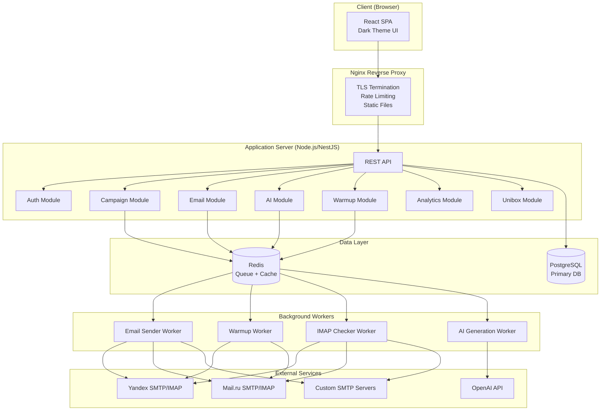
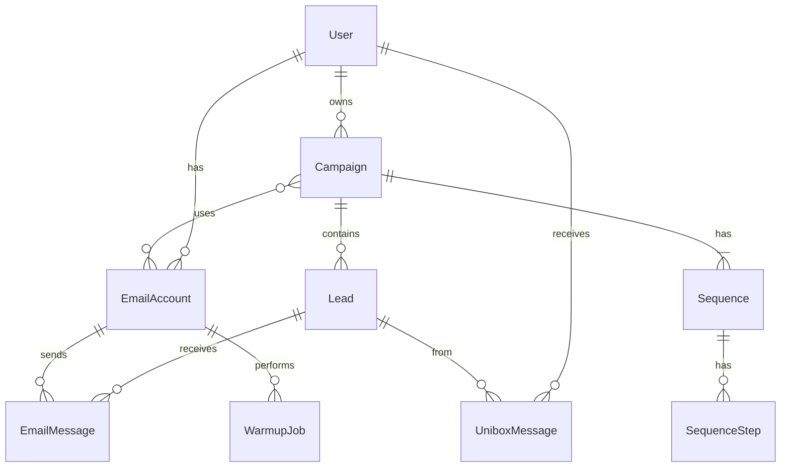

# Architecture: ColdMail.ru

**Date:** 2026-04-29
**Style:** Distributed Monolith (Monorepo)
**Deploy:** Docker Compose on VPS (AdminVPS/HOSTKEY, Russia)

---

## Architecture Overview

### Architecture Style

**Distributed Monolith** — single codebase (monorepo) with modular internal services, deployed as Docker containers via Docker Compose on a single VPS. Modules communicate via in-process calls (monolith) with clear interfaces allowing future extraction to microservices.

### High-Level Diagram



---

## Component Breakdown

### 1. Frontend (React SPA)

| Aspect | Decision |
|--------|----------|
| Framework | React 18 + Next.js (App Router, SPA mode) |
| Styling | Tailwind CSS (dark theme tokens from Instantly UI ref) |
| State | Zustand (lightweight) + React Query (server state) |
| Routing | Next.js App Router |
| UI Components | Custom component library based on Instantly design system |
| Charts | Recharts |
| Forms | React Hook Form + Zod validation |
| Auth | JWT in httpOnly cookies |

**Key UI Modules (based on Instantly reference):**
- `GlobalSidebar` — narrow icon sidebar (w-16), fixed left
- `SecondarySidebar` — contextual menu per module (w-72)
- `TopBar` — balance, plan badge, org selector
- `DataTable` — campaigns, leads, accounts (sort, filter, pagination)
- `StatusBadge` — campaign/account status indicators
- `EmptyState` — onboarding empty states with CTA
- `PromptInput` — AI generation input (large, centered)
- `Modal` — upgrade, confirmations
- `WarmupHealthIndicator` — flame icon + progress bar

### 2. Backend (NestJS)

| Aspect | Decision |
|--------|----------|
| Runtime | Node.js 20 LTS |
| Framework | NestJS 10 (modular, DI, TypeScript) |
| ORM | Prisma (type-safe, migrations) |
| Validation | class-validator + class-transformer |
| Auth | Passport.js + JWT strategy |
| Queue | BullMQ (Redis-backed) |
| Logging | Pino (structured JSON) |
| Testing | Jest + Supertest |

**Internal Modules:**
```
src/
├── auth/          # JWT, login, register, refresh
���── accounts/      # Email account CRUD, connection testing
├── campaigns/     # Campaign lifecycle, scheduling
├── sequences/     # Sequence steps, template rendering
├── leads/         # Lead management, CSV import, status
├── warmup/        # Warmup engine logic, peer selection
├── email/         # SMTP sending, IMAP checking, deliverability
├── ai/            # OpenAI integration, prompt management
├── unibox/        # Reply aggregation, thread management
├── analytics/     # Metrics calculation, time-series
├── compliance/    # 38-ФЗ checker, opt-out management
└── common/        # Shared: encryption, logging, errors
```

### 3. Background Workers (BullMQ)

| Queue | Purpose | Concurrency | Schedule |
|-------|---------|:-----------:|----------|
| `email:send` | Send campaign emails | 5 | On demand (scheduler pushes) |
| `email:schedule` | Calculate next batch to send | 1 | Every 5 min (cron) |
| `warmup:run` | Execute warmup interactions | 3 | Daily at 08:00 MSK |
| `warmup:send` | Send individual warmup emails | 5 | On demand |
| `imap:check` | Check inboxes for replies/bounces | 3 | Every 2 min |
| `ai:generate` | Batch AI personalization | 2 | On demand |
| `analytics:update` | Recalculate campaign metrics | 1 | Every 10 min |

### 4. Database (PostgreSQL)



**Key indexes:**
- `leads(campaign_id, status, next_send_at)` — scheduler query
- `email_messages(campaign_id, status)` — analytics aggregation
- `email_accounts(user_id, warmup_status)` — account listing
- `unibox_messages(user_id, read, received_at)` — inbox listing

### 5. Redis (Cache + Queue)

| Purpose | Key Pattern | TTL |
|---------|-------------|-----|
| Session/JWT blacklist | `auth:blacklist:{token_id}` | 15 min |
| Rate limiting | `ratelimit:{user_id}:{endpoint}` | 1 min |
| Account daily counters | `account:{id}:sent_today` | Reset at midnight |
| Campaign metrics cache | `analytics:{campaign_id}` | 10 min |
| BullMQ queues | `bull:{queue_name}:*` | — |

---

## Technology Stack

| Layer | Technology | Version | Rationale |
|-------|------------|---------|-----------|
| **Frontend** | React + Next.js | 18 / 14 | Component model, SSR optional, strong ecosystem |
| **Styling** | Tailwind CSS | 3.4 | Utility-first, matches Instantly design tokens |
| **Backend** | NestJS (Node.js) | 10 / 20 | TypeScript, modular, enterprise-ready |
| **ORM** | Prisma | 5.x | Type-safe, great migrations, PostgreSQL optimized |
| **Database** | PostgreSQL | 16 | ACID, JSON support, full-text search, mature |
| **Cache/Queue** | Redis | 7.x | BullMQ queues, caching, rate limiting |
| **Email** | Nodemailer | 6.x | Mature SMTP client, good for custom flows |
| **IMAP** | imapflow | 1.x | Modern IMAP client for Node.js |
| **AI** | OpenAI SDK | 4.x | GPT-4o-mini for cost-effective generation |
| **Auth** | JWT + bcrypt | — | Stateless, scalable |
| **Reverse Proxy** | Nginx | 1.25 | TLS, rate limiting, static files |
| **Container** | Docker + Compose | 24 / 2.x | Consistent deploys, 152-ФЗ VPS |
| **Monitoring** | Prometheus + Grafana | — | Self-hosted metrics |
| **Logging** | Pino + Loki | — | Structured logging, searchable |
| **CI/CD** | GitHub Actions | — | Auto-deploy on push to main |

---

## Data Architecture

### Encryption Strategy

| Data | At Rest | In Transit | Notes |
|------|---------|-----------|-------|
| User passwords | bcrypt (12 rounds) | TLS 1.3 | Never stored plaintext |
| SMTP/IMAP credentials | AES-256-GCM | TLS 1.3 | Encryption key from ENV |
| Email content | Plain (PostgreSQL) | TLS 1.3 | Not PII, no encryption needed |
| Lead PII (name, email) | Plain (PostgreSQL) | TLS 1.3 | Server in RF = compliant |
| JWT tokens | — | TLS 1.3 | Short-lived (15 min) |

### Backup Strategy

| Data | Frequency | Retention | Location |
|------|-----------|-----------|----------|
| PostgreSQL | Daily full + hourly WAL | 30 days | Same DC, different server |
| Redis | RDB every 1h | 7 days | Local disk |
| User uploads (CSV) | — | Deleted after import | Not backed up |

---

## Security Architecture

### Authentication Flow

```
[Browser] → POST /auth/login {email, password}
    → [API] → bcrypt.compare(password, user.password_hash)
        → Success → generate JWT (15min) + Refresh (7d)
        → Set httpOnly cookie (access_token, refresh_token)
        → Return user profile
    → [Browser] → stores nothing (cookies are httpOnly)

[Browser] → GET /api/* (with cookie)
    → [Nginx] → forward
    → [API] → JWT verify from cookie
        → Valid → process request
        → Expired → 401 → browser calls /auth/refresh
```

### Authorization Model

```
Roles:
  - owner: full access to workspace
  - member: campaign management, no billing/settings

Permissions:
  - campaigns:* (CRUD, start/pause)
  - accounts:* (CRUD, warmup control)
  - leads:* (import, update status)
  - analytics:read
  - settings:* (owner only)
  - billing:* (owner only)
```

### Rate Limiting

| Endpoint | Limit | Window | Action on exceed |
|----------|-------|--------|-----------------|
| POST /auth/login | 5 attempts | 15 min | Block IP |
| POST /auth/register | 3 | 1 hour | Block IP |
| POST /ai/* | 30 | 1 min | 429 response |
| GET /api/* | 100 | 1 min | 429 response |
| POST /campaigns/*/leads (CSV) | 5 | 1 hour | 429 response |

---

## Infrastructure

### VPS Configuration (MVP)

| Resource | Spec | Purpose |
|----------|------|---------|
| **Server 1** (App) | 4 vCPU, 8 GB RAM, 100 GB SSD | App + Workers + Nginx |
| **Server 2** (Data) | 2 vCPU, 4 GB RAM, 200 GB SSD | PostgreSQL + Redis |
| **Location** | Russia (AdminVPS Moscow / HOSTKEY SPb) | 152-ФЗ compliance |
| **OS** | Ubuntu 22.04 LTS | Stable, Docker-friendly |

### Docker Compose Services

```yaml
services:
  nginx:          # Reverse proxy + TLS + static
  app:            # NestJS API (3 replicas optional)
  worker-email:   # Email sending worker
  worker-warmup:  # Warmup worker
  worker-imap:    # IMAP checker
  worker-ai:      # AI generation
  postgres:       # Primary database
  redis:          # Queue + cache
  grafana:        # Monitoring dashboards
  prometheus:     # Metrics collection
  loki:           # Log aggregation
```

### Deployment Flow

```
Developer → git push main → GitHub Actions:
  1. Run tests (jest)
  2. Build Docker images
  3. Push to private registry
  4. SSH to VPS → docker compose pull && docker compose up -d
  5. Health check → rollback if failed
```

---

## Scalability Considerations

### Horizontal Scaling Path

```
MVP (1 VPS):
  Single VPS, all-in-one Docker Compose
  Capacity: ~100 users, 50K emails/day

Growth (2-3 VPS):
  Separate DB server
  Add worker replicas
  Capacity: ~1,000 users, 500K emails/day

Scale (Kubernetes):
  Migrate to k8s on Yandex Cloud / Selectel
  Horizontal pod autoscaling for workers
  Managed PostgreSQL (Yandex MDB)
  Capacity: ~10,000+ users, 5M emails/day
```

### Bottleneck Analysis

| Bottleneck | Threshold | Solution |
|-----------|-----------|----------|
| SMTP sending rate | 50/account/day (Yandex) | More accounts, IP rotation |
| IMAP checking frequency | 2 min × N accounts | Batch processing, webhooks where possible |
| AI generation latency | 10s per email | Pre-generate in batches, queue |
| PostgreSQL connections | 100 connections | PgBouncer connection pooling |
| Redis memory | 1 GB for queues | Key TTL, cleanup jobs |

---

## UI Architecture (from Instantly Reference)

### Layout System

```
┌──────────────────────────────────────────────────────────────┐
│ [Icon Sidebar w-16] │ [Secondary Sidebar w-72] │ [Content]  │
│                     │                          │            │
│ ● Dashboard        │ (context-dependent)      │            │
│ ● Campaigns        │                          │            │
│ ● Accounts         │                          │            │
│ ● Unibox           │                          │            │
│ ● Analytics        │                          │            │
│ ● AI Generator     │                          │            │
│ ● Settings         │                          │            │
│                     │                          │            │
│ [Avatar/Profile]   │                          │            │
└──────────────────────────────────────────────────────────────┘
```

### Design Tokens (from screens.json analysis)

```css
:root {
  /* Background */
  --bg-primary: #0f1014;
  --bg-secondary: #15171c;
  --bg-tertiary: #17191f;
  --bg-input: #111318;

  /* Border */
  --border-default: #2a2d34;
  --border-hover: #3a3d44;

  /* Brand */
  --color-primary: #2563eb;
  --color-primary-hover: #3b82f6;
  --color-gradient: linear-gradient(to right, #2563eb, #7c3aed);

  /* Status */
  --color-success: #22c55e;
  --color-warning: #facc15;
  --color-error: #ef4444;

  /* Text */
  --text-primary: #e5e7eb;
  --text-secondary: #9ca3af;
  --text-muted: #8b949e;

  /* Typography */
  --font-family: 'Inter', system-ui, sans-serif;
  --font-size-xs: 11px;
  --font-size-sm: 13px;
  --font-size-base: 14px;
  --font-size-lg: 16px;
  --font-size-xl: 20px;
  --font-size-2xl: 24px;
  --font-size-3xl: 28px;

  /* Spacing */
  --radius-md: 8px;
  --radius-lg: 12px;
  --radius-xl: 16px;

  /* Sidebar */
  --sidebar-icon-width: 64px;
  --sidebar-secondary-width: 288px;
}
```

### Component Library

| Component | Tailwind Classes | Usage |
|-----------|-----------------|-------|
| `Button.Primary` | `rounded-xl px-4 py-2 font-semibold bg-blue-600 hover:bg-blue-500 text-white` | Main actions |
| `Button.Secondary` | `rounded-xl px-4 py-2 font-semibold bg-white/10 hover:bg-white/15 text-gray-200` | Cancel, back |
| `Button.Gradient` | `rounded-xl px-4 py-2 font-semibold bg-gradient-to-r from-blue-600 to-violet-600 text-white` | AI actions |
| `Card` | `rounded-2xl border border-[#2a2d34] bg-[#15171c] p-6` | Containers |
| `Input` | `bg-[#111318] border border-[#2a2d34] rounded-xl h-12 px-4 text-sm` | Form inputs |
| `Badge.Success` | `inline-flex items-center rounded-md px-2 py-1 text-xs font-semibold bg-emerald-500/20 text-emerald-300` | Active status |
| `Badge.Warning` | `bg-yellow-500/20 text-yellow-300` | Paused/warning |
| `Badge.Error` | `bg-red-500/20 text-red-300` | Error/bounced |
| `Table.Header` | `uppercase text-xs text-[#8b949e] tracking-wider` | Table headers |
| `EmptyState` | `flex min-h-[420px] flex-col items-center justify-center text-center text-slate-400` | No data |

---

## Integration Architecture

### Email Sending Flow

```
Campaign Scheduler (cron every 5min)
  → Finds leads ready to send
  → Creates EmailMessage records (status: "queued")
  → Pushes to BullMQ queue "email:send"

Email Send Worker
  → Picks job from queue
  → Decrypts SMTP credentials
  ��� Connects to SMTP (Yandex/Mail.ru/Custom)
  → Sends email with proper headers (SPF/DKIM/DMARC)
  → Updates EmailMessage status → "sent"
  → Increments account sent_today counter
  → Adds tracking pixel (open tracking)
  → Adds click tracking links

IMAP Check Worker (every 2min)
  → Connects to IMAP
  → Fetches new messages
  → Matches replies via Message-ID/References headers
  → Creates UniboxMessage records
  → Updates Lead status
  → Stops sequence for replied leads
```

### AI Integration

```
AI Generation Request
  → Validate prompt + rate limit check
  → Push to BullMQ queue "ai:generate"

AI Worker
  → Build prompt (product context + lead data + tone)
  → Call OpenAI API (gpt-4o-mini)
  → Validate output (spam check, length, quality score)
  → Return personalized email
  → Cache result for similar leads (optional)
```

---

## Monitoring & Observability

### Key Metrics (Prometheus)

| Metric | Type | Alert Threshold |
|--------|------|----------------|
| `http_request_duration_seconds` | Histogram | p99 > 2s |
| `emails_sent_total` | Counter | — |
| `emails_bounced_total` | Counter | rate > 5% per hour |
| `warmup_inbox_rate` | Gauge | < 60% |
| `queue_depth{queue}` | Gauge | > 1000 |
| `ai_generation_duration_seconds` | Histogram | p99 > 15s |
| `active_campaigns` | Gauge | — |
| `postgres_connections_active` | Gauge | > 80 |

### Logging Strategy

```json
{
  "level": "info",
  "timestamp": "2026-04-29T10:30:00Z",
  "service": "email-worker",
  "message": "Email sent successfully",
  "campaign_id": "uuid",
  "lead_id": "uuid",
  "account_id": "uuid",
  "duration_ms": 450
}
```

Levels: error (alerts), warn (investigate), info (operations), debug (development only)
